``` r
CS <- read.csv("Case Shipments.csv") %>%
  select(-Month) %>%
  ts(start = c(1983,1), frequency=12)
SI <- read.csv("Seasonality Index.csv")

plot(CS)
```

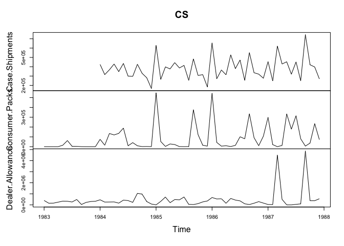

Q1
==

### sales(total shipment) from 01/1984

``` r
#total shipment 
ts <- window(CS[,1], start = c(1984,1))
#consumer pack (lag = 0,1,2)
cp <- window(CS[,2], start = c(1984,1))
cp_l1 <- window(CS[,2], start = c(1983,12), end = c(1987,11))
cp_l2 <- window(CS[,2], start = c(1983,11), end = c(1987,10))

#dealer allowance (lag = 0,1,2)
da <- window(CS[,3], start = c(1984,1))
da_l1 <- window(CS[,3], start = c(1983,12), end = c(1987,11))
da_l2 <- window(CS[,3], start = c(1983,11), end = c(1987,10))

#creating data matrix
xmat <- data.frame(ts, cp, cp_l1, cp_l2, da, da_l1, da_l2)
x <- model.matrix(ts ~., data = xmat)[,-1]
y <- data.frame(ts)


#split into training, test sets (1984/01 - 1986/12 & 1987/01 - 1987/12)
x.tr <- x[1:36,]
x.te <- x[37:48,]
y.tr <- y[1:36,]
y.te <- y[37:48,]

set.seed(1)
m.L <- cv.glmnet(x=x.tr, y=y.tr,  alpha=1)
plot(m.L)
```

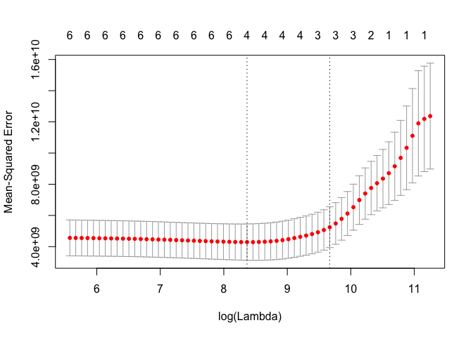

``` r
L.min <- m.L$lambda.min
L.1se <- m.L$lambda.1se
coefficients(m.L, s=c(L.min,L.1se))
```

    ## 7 x 2 sparse Matrix of class "dgCMatrix"
    ##                         1             2
    ## (Intercept)  2.964639e+05  3.009903e+05
    ## cp           5.487450e-01  4.742323e-01
    ## cp_l1       -1.521980e-01 -5.948879e-02
    ## cp_l2        .             .           
    ## da           1.581947e-01  8.849732e-02
    ## da_l1       -5.206723e-02  .           
    ## da_l2        .             .

``` r
#choose the variables with lambda.1se for parsimonious model (could use lambda.min)
#cp, cp_l1, da have non-zero coefs
```

cp, cp\_l1, da have non-zero coefficents and should be used to estimate the value of lagged effects of “Consumer Packs” and “Dealer Allowances” on “Case Shipments” for Treat.

Q2
==

### reduced x variables

``` r
xr <- subset(x, select = c('cp', 'cp_l1', 'da'))
xr.tr <- xr[1:36,]
xr.te <- xr[37:48,]
y <- ts
y.tr <- window(y, end = c(1986,12))
y.te <- window(y, start = c(1987,1))
```

``` r
#examine the plot of ts and ACF PACF
tsdisplay(y.tr, lag = 24)#not stationary
```

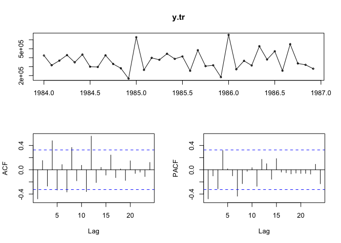

``` r
tsdisplay(diff(y.tr), lag = 24)#not stationary
```

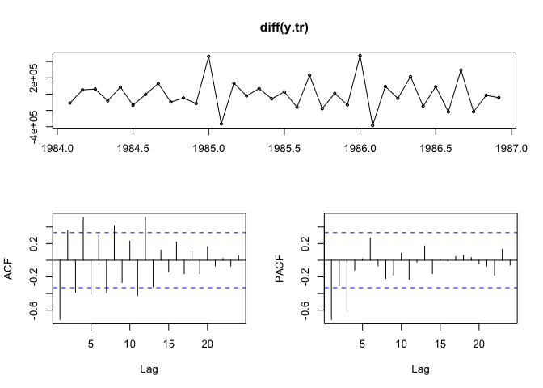

``` r
tsdisplay(diff(y.tr,12), lag = 24)#not very stationary
```

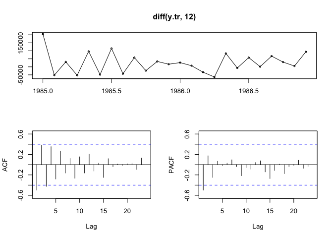

``` r
tsdisplay(diff(diff(y.tr,12)), lag = 24)#still not very stationary
```

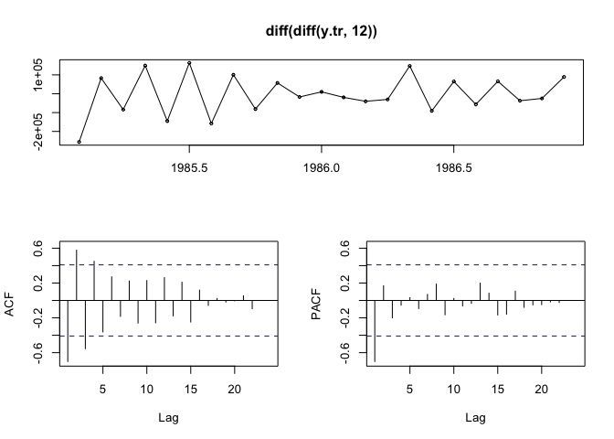

From the residual plots, none of these transforms appear stationary.

``` r
adf.test(y.tr)#not stationary
```

    ## 
    ##  Augmented Dickey-Fuller Test
    ## 
    ## data:  y.tr
    ## Dickey-Fuller = -2.6684, Lag order = 3, p-value = 0.3131
    ## alternative hypothesis: stationary

``` r
adf.test(diff(y.tr))#stationary
```

    ## Warning in adf.test(diff(y.tr)): p-value smaller than printed p-value

    ## 
    ##  Augmented Dickey-Fuller Test
    ## 
    ## data:  diff(y.tr)
    ## Dickey-Fuller = -5.3281, Lag order = 3, p-value = 0.01
    ## alternative hypothesis: stationary

``` r
adf.test(diff(y.tr,12))#not stationary
```

    ## 
    ##  Augmented Dickey-Fuller Test
    ## 
    ## data:  diff(y.tr, 12)
    ## Dickey-Fuller = -2.8545, Lag order = 2, p-value = 0.2469
    ## alternative hypothesis: stationary

``` r
adf.test(diff(diff(y.tr,12)))#stationary, choose this?
```

    ## Warning in adf.test(diff(diff(y.tr, 12))): p-value smaller than printed p-
    ## value

    ## 
    ##  Augmented Dickey-Fuller Test
    ## 
    ## data:  diff(diff(y.tr, 12))
    ## Dickey-Fuller = -4.8775, Lag order = 2, p-value = 0.01
    ## alternative hypothesis: stationary

diff(y.tr) and diff(diff(y.tr,12) have p-values smaller than the printed p-values and thus pass the ADF test. we can conclude these time series are stationary. y.tr and diff(y.tr, 12) had larger p-values and did not pass the ADF test.

``` r
##d=1, D=1
#begin with(1,1,0)(0,1,0)
m.A1 <- Arima(y.tr, xreg = xr.tr, order = c(1,1,0), seasonal = c(0,1,0))
summary(m.A1) 
```

    ## Series: y.tr 
    ## Regression with ARIMA(1,1,0)(0,1,0)[12] errors 
    ## 
    ## Coefficients:
    ##          ar1      cp    cp_l1      da
    ##       -0.833  0.3127  -0.0635  0.0743
    ## s.e.   0.130  0.0857   0.0577  0.0288
    ## 
    ## sigma^2 estimated as 2.454e+09:  log likelihood=-279.67
    ## AIC=569.34   AICc=572.87   BIC=575.02
    ## 
    ## Training set error measures:
    ##                     ME    RMSE      MAE        MPE    MAPE      MASE
    ## Training set -842.9776 35989.4 23086.89 -0.9394358 6.52228 0.4432056
    ##                     ACF1
    ## Training set -0.08500168

``` r
tsdisplay(diff(diff(arima.errors(m.A1),12)), lag=24) #MA?
```

    ## Deprecated, use residuals.Arima(object, type='regression') instead

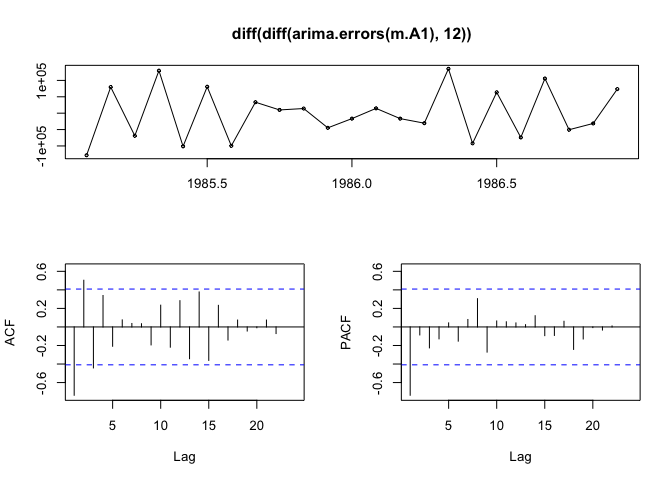

``` r
tsdiag(m.A1, gof.lag=24)
```

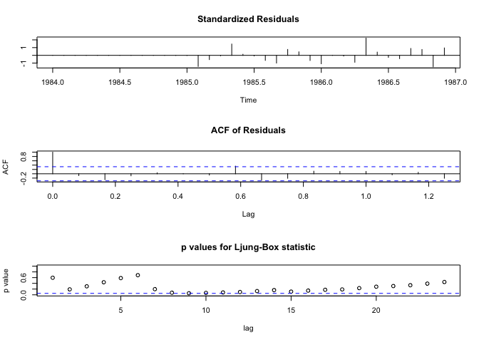

``` r
m.A2 <- Arima(y.tr, xreg = xr.tr, order = c(1,1,4), seasonal = c(0,1,0))
summary(m.A2) 
```

    ## Series: y.tr 
    ## Regression with ARIMA(1,1,4)(0,1,0)[12] errors 
    ## 
    ## Coefficients:
    ##           ar1      ma1      ma2      ma3     ma4      cp    cp_l1      da
    ##       -0.7034  -0.3250  -0.2533  -0.3257  0.9990  0.2436  -0.0634  0.0305
    ## s.e.   0.1831   0.4881   0.3824   0.4242  0.5765  0.0971   0.0431  0.0427
    ## 
    ## sigma^2 estimated as 1.628e+09:  log likelihood=-276.21
    ## AIC=570.43   AICc=584.27   BIC=580.65
    ## 
    ## Training set error measures:
    ##                     ME    RMSE      MAE        MPE     MAPE     MASE
    ## Training set -740.1724 26044.9 16278.97 -0.6848667 4.507178 0.312512
    ##                    ACF1
    ## Training set 0.01773301

``` r
tsdisplay(diff(diff(arima.errors(m.A2),12)), lag=24)
```

    ## Deprecated, use residuals.Arima(object, type='regression') instead

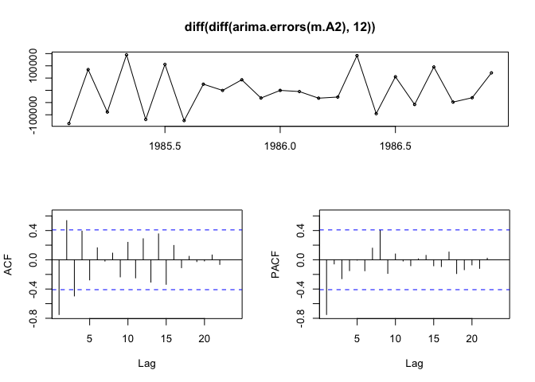

``` r
tsdiag(m.A2, gof.lag=24)
```

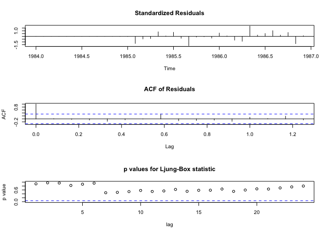

``` r
#how about auto arima?
m.AA <- auto.arima(y.tr, xreg = xr.tr)
summary(m.AA) #(1,0,0)(0,1,0)[12]
```

    ## Series: y.tr 
    ## Regression with ARIMA(1,0,0)(0,1,0)[12] errors 
    ## 
    ## Coefficients:
    ##           ar1      drift      cp    cp_l1      da
    ##       -0.4690  1667.2584  0.3148  -0.1143  0.0593
    ## s.e.   0.2316   474.9718  0.0945   0.0608  0.0278
    ## 
    ## sigma^2 estimated as 1.967e+09:  log likelihood=-288.17
    ## AIC=588.35   AICc=593.29   BIC=595.42
    ## 
    ## Training set error measures:
    ##                    ME     RMSE      MAE        MPE    MAPE      MASE
    ## Training set 710.0443 32223.38 21745.34 -0.3667756 5.80637 0.4174515
    ##                   ACF1
    ## Training set 0.1262902

``` r
tsdisplay(diff(arima.errors(m.AA),12), lag=24) #satisfy the assumption (1,0,0)(0,1,0)[12]
```

    ## Deprecated, use residuals.Arima(object, type='regression') instead

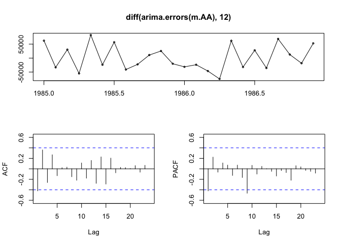

``` r
tsdiag(m.AA, gof.lag=24)
```

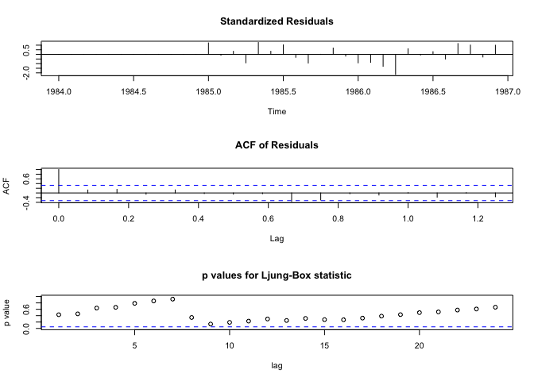

``` r
#compare three models on test sets
f.A1 = forecast(m.A1, xreg = xr.te, h=12)
f.A2 = forecast(m.A2, xreg = xr.te, h=12)
f.AA = forecast(m.AA, xreg = xr.te, h=12)

par(mfrow=c(1,3))
plot(f.A1)
points(y.te, col="red", pch=19)

plot(f.A2)
points(y.te, col="red", pch=19)

plot(f.AA)
points(y.te, col="red", pch=19)
```

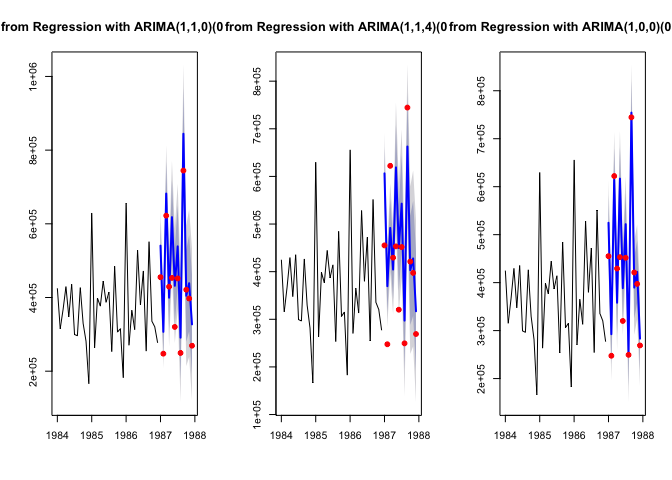

``` r
accuracy(f.A1, y.te)
```

    ##                       ME     RMSE      MAE         MPE     MAPE      MASE
    ## Training set   -842.9776 35989.40 23086.89  -0.9394358  6.52228 0.4432056
    ## Test set     -63569.7531 81448.13 71289.76 -16.1753812 17.98594 1.3685695
    ##                     ACF1 Theil's U
    ## Training set -0.08500168        NA
    ## Test set     -0.17684246 0.2772124

``` r
accuracy(f.A2, y.te)#overfitting
```

    ##                       ME     RMSE      MAE         MPE      MAPE     MASE
    ## Training set   -740.1724  26044.9 16278.97  -0.6848667  4.507178 0.312512
    ## Test set     -44194.2548 100192.7 86731.35 -15.1866531 22.193274 1.665006
    ##                    ACF1 Theil's U
    ## Training set 0.01773301        NA
    ## Test set     0.21817696 0.3316798

``` r
accuracy(f.AA, y.te)
```

    ##                       ME     RMSE      MAE        MPE     MAPE      MASE
    ## Training set    710.0443 32223.38 21745.34 -0.3667756  5.80637 0.4174515
    ## Test set     -29638.9650 64704.95 47999.12 -7.8467304 12.05635 0.9214526
    ##                     ACF1 Theil's U
    ## Training set  0.12629015        NA
    ## Test set     -0.05016364 0.1843689

The auto arima model seems to be the best, as it has the lowest out of sample RMSE. This allows us to choose ARIMA(1,0,0)(0,1,0)\[12\] as our model to forecast monthly demand for Treat twelve months into the future.

Q3
==

adjust demand for seasonality
-----------------------------

``` r
s = SI[,2]/100
ya = y/s
ya.tr <- window(ya, end = c(1986,12))
ya.te <- window(ya, start = c(1987,1))

tsdisplay(ya.tr, lag = 24)#~stationary
```

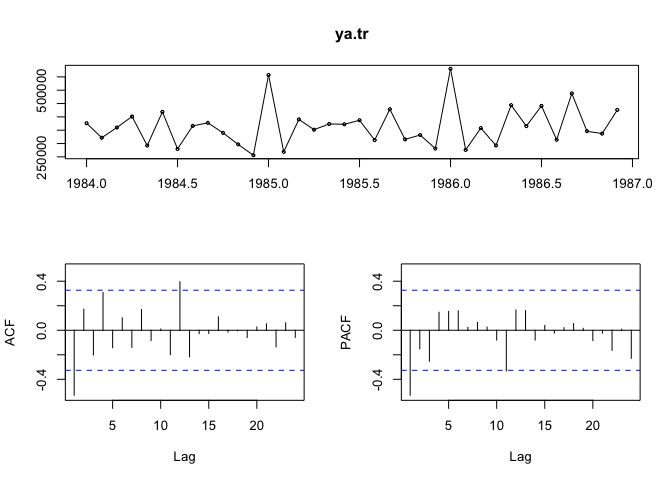

``` r
tsdisplay(diff(ya.tr,12), lag = 24)#not very stationary
```

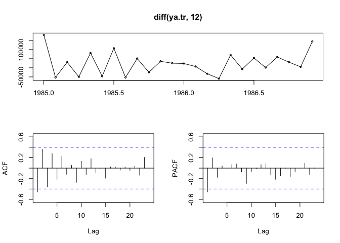

``` r
tsdisplay(diff(diff(ya.tr,12)), lag = 24)#still not very stationary
```

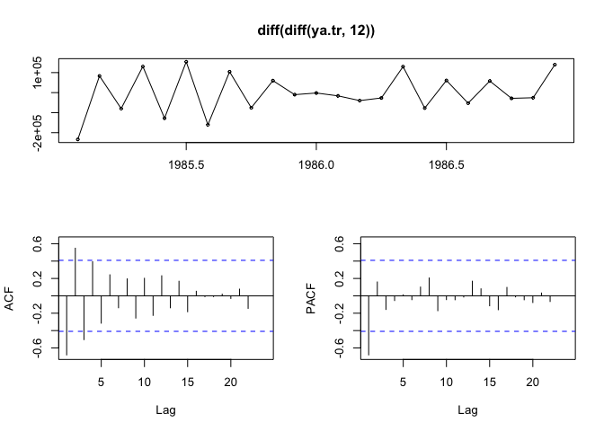

From inspection of the residual plots, none of these time series appear to be stationary.

``` r
adf.test(ya.tr)#stationary
```

    ## Warning in adf.test(ya.tr): p-value smaller than printed p-value

    ## 
    ##  Augmented Dickey-Fuller Test
    ## 
    ## data:  ya.tr
    ## Dickey-Fuller = -4.4784, Lag order = 3, p-value = 0.01
    ## alternative hypothesis: stationary

``` r
adf.test(diff(ya.tr,12))#not stationary
```

    ## 
    ##  Augmented Dickey-Fuller Test
    ## 
    ## data:  diff(ya.tr, 12)
    ## Dickey-Fuller = -2.2704, Lag order = 2, p-value = 0.4694
    ## alternative hypothesis: stationary

``` r
adf.test(diff(diff(ya.tr,12))) #stationary
```

    ## 
    ##  Augmented Dickey-Fuller Test
    ## 
    ## data:  diff(diff(ya.tr, 12))
    ## Dickey-Fuller = -4.1601, Lag order = 2, p-value = 0.01767
    ## alternative hypothesis: stationary

ya.tr and diff(diff(ya.tr, 12)) have p-values smaller than the printed p-values and thus pass the ADF test. We can conclude these time series are stationary. diff(ya.tr, 12) had a larger p-value and did not pass the ADF test.

``` r
##d=0, D=0
#begin with(1,0,1)(0,0,1)
m.Aa1 <- Arima(ya.tr, xreg = xr.tr, order = c(1,0,1), seasonal = c(0,0,1))
summary(m.Aa1) 
```

    ## Series: ya.tr 
    ## Regression with ARIMA(1,0,1)(0,0,1)[12] errors 
    ## 
    ## Coefficients:
    ##          ar1      ma1     sma1   intercept      cp    cp_l1      da
    ##       0.7005  -0.5055  -0.9998  300941.024  0.4327  -0.1620  0.1127
    ## s.e.  0.2318   0.2499   0.5906    9704.093  0.0281   0.0266  0.0208
    ## 
    ## sigma^2 estimated as 846188559:  log likelihood=-425.55
    ## AIC=867.1   AICc=872.44   BIC=879.77
    ## 
    ## Training set error measures:
    ##                     ME     RMSE      MAE       MPE     MAPE      MASE
    ## Training set -2526.888 26108.46 19971.57 -1.294957 5.688518 0.3887644
    ##                    ACF1
    ## Training set -0.1525121

``` r
tsdisplay(arima.errors(m.Aa1), lag=24) #seems like maybe no seasonal ARIMA
```

    ## Deprecated, use residuals.Arima(object, type='regression') instead

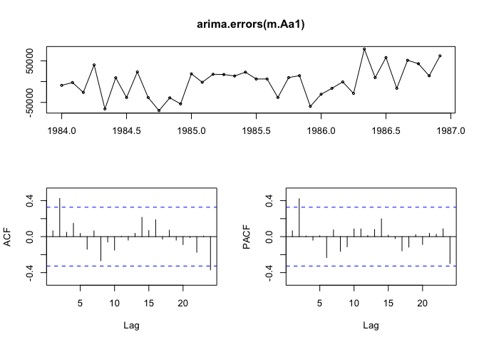

``` r
tsdiag(m.Aa1, gof.lag=24)
```

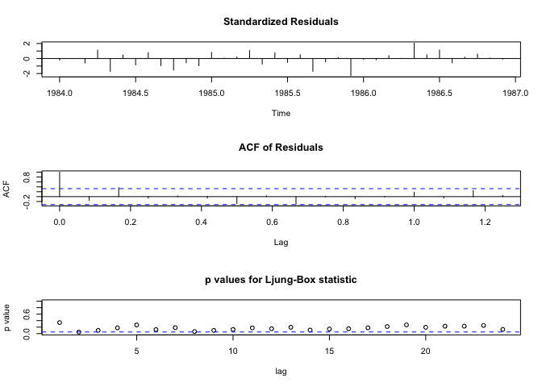

``` r
m.Aa2 <- Arima(ya.tr, xreg = xr.tr, order = c(1,0,0))
summary(m.Aa2) 
```

    ## Series: ya.tr 
    ## Regression with ARIMA(1,0,0) errors 
    ## 
    ## Coefficients:
    ##          ar1  intercept      cp    cp_l1      da
    ##       0.0084   308412.0  0.4332  -0.1554  0.0881
    ## s.e.  0.2097    14357.1  0.0515   0.0422  0.0277
    ## 
    ## sigma^2 estimated as 1.465e+09:  log likelihood=-428.29
    ## AIC=868.57   AICc=871.47   BIC=878.07
    ## 
    ## Training set error measures:
    ##                    ME    RMSE      MAE       MPE     MAPE     MASE
    ## Training set 2.494073 35520.8 28551.37 -1.061893 8.092023 0.555778
    ##                      ACF1
    ## Training set -0.003610557

``` r
tsdisplay(arima.errors(m.Aa2), lag=24) #seems like no more improvement
```

    ## Deprecated, use residuals.Arima(object, type='regression') instead

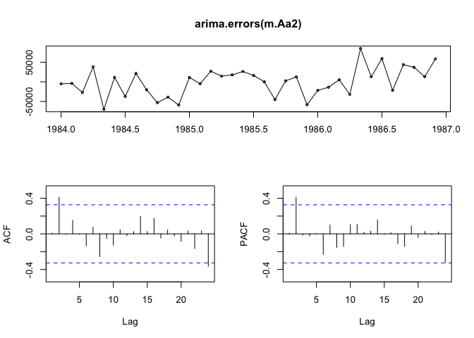

``` r
tsdiag(m.Aa2, gof.lag=24)
```

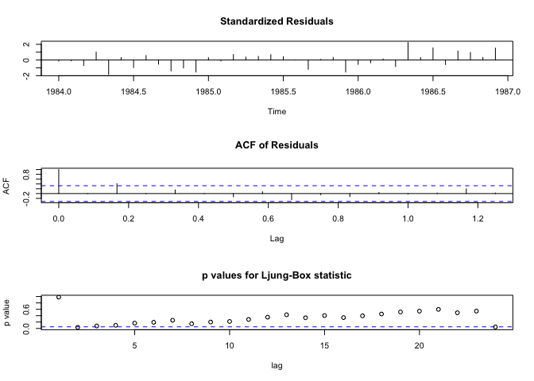

``` r
##d=0, D=1
#maybe (1,0,0)(0,1,0)
m.Aa3 <- Arima(ya.tr, xreg = xr.tr, order = c(1,0,0), seasonal = c(0,1,0))
summary(m.Aa3) 
```

    ## Series: ya.tr 
    ## Regression with ARIMA(1,0,0)(0,1,0)[12] errors 
    ## 
    ## Coefficients:
    ##           ar1      cp    cp_l1      da
    ##       -0.1324  0.3957  -0.1152  0.0789
    ## s.e.   0.2636  0.1046   0.0723  0.0375
    ## 
    ## sigma^2 estimated as 2.696e+09:  log likelihood=-292.46
    ## AIC=594.91   AICc=598.25   BIC=600.8
    ## 
    ## Training set error measures:
    ##                    ME    RMSE      MAE     MPE     MAPE      MASE
    ## Training set 14244.03 38702.2 25362.05 3.34723 6.611802 0.4936949
    ##                     ACF1
    ## Training set -0.07920786

``` r
tsdisplay(diff(arima.errors(m.Aa3),12), lag=24) #maybe(0,0,0)(1,1,0)
```

    ## Deprecated, use residuals.Arima(object, type='regression') instead


``` r
tsdiag(m.Aa3, gof.lag=24)
```

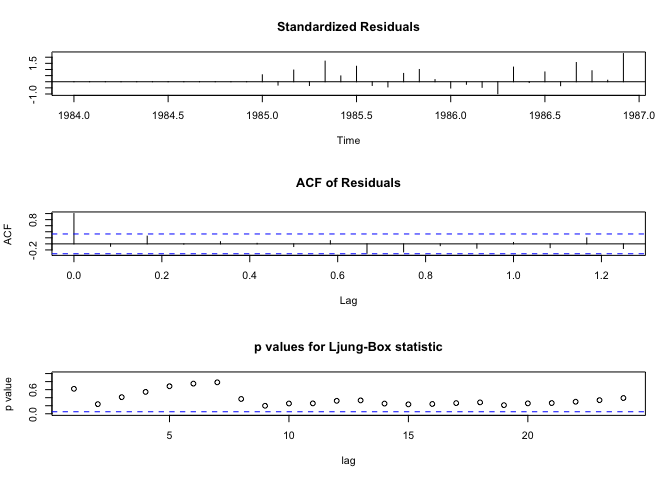

``` r
m.Aa4 <- Arima(ya.tr, xreg = xr.tr, order = c(0,0,0), seasonal = c(0,1,0))
summary(m.Aa4) 
```

    ## Series: ya.tr 
    ## Regression with ARIMA(0,0,0)(0,1,0)[12] errors 
    ## 
    ## Coefficients:
    ##           cp    cp_l1      da
    ##       0.4181  -0.1216  0.0860
    ## s.e.  0.0933   0.0719  0.0367
    ## 
    ## sigma^2 estimated as 2.597e+09:  log likelihood=-292.58
    ## AIC=593.17   AICc=595.27   BIC=597.88
    ## 
    ## Training set error measures:
    ##                    ME    RMSE      MAE      MPE     MAPE      MASE
    ## Training set 12853.85 38923.9 25380.23 2.949789 6.599295 0.4940489
    ##                    ACF1
    ## Training set -0.1854509

``` r
tsdisplay(diff(arima.errors(m.Aa4),12), lag=24)
```

    ## Deprecated, use residuals.Arima(object, type='regression') instead

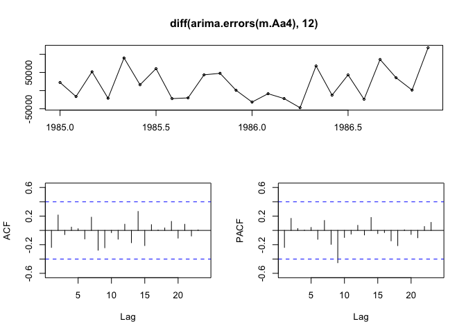

``` r
tsdiag(m.Aa4, gof.lag=24)
```

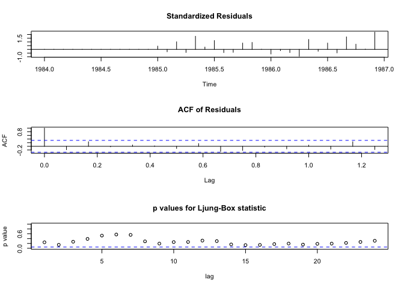

``` r
#how about auto arima?
m.AA2 <- auto.arima(ya.tr, xreg = xr.tr)
summary(m.AA2) #same as Aa3
```

    ## Series: ya.tr 
    ## Regression with ARIMA(0,0,0)(0,1,0)[12] errors 
    ## 
    ## Coefficients:
    ##           drift      cp    cp_l1      da
    ##       1677.7176  0.3888  -0.1402  0.0817
    ## s.e.   757.9623  0.0861   0.0660  0.0335
    ## 
    ## sigma^2 estimated as 2.265e+09:  log likelihood=-290.36
    ## AIC=590.71   AICc=594.04   BIC=596.6
    ## 
    ## Training set error measures:
    ##                    ME     RMSE      MAE        MPE     MAPE      MASE
    ## Training set 93.84116 35471.37 25694.55 -0.5863586 6.959521 0.5001674
    ##                    ACF1
    ## Training set -0.2614756

``` r
#compare four models on test sets
f.Aa1 = forecast(m.Aa1, xreg = xr.te, h=12)
f.Aa2 = forecast(m.Aa2, xreg = xr.te, h=12)
f.Aa3 = forecast(m.Aa3, xreg = xr.te, h=12)
f.Aa4 = forecast(m.Aa4, xreg = xr.te, h=12)

par(mfrow=c(2,2))
plot(f.Aa1)
points(ya.te, col="red", pch=19)

plot(f.Aa2)
points(ya.te, col="red", pch=19)

plot(f.Aa3)
points(ya.te, col="red", pch=19)

plot(f.Aa4)
points(ya.te, col="red", pch=19)
```

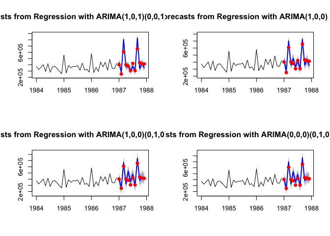

``` r
accuracy(f.Aa1$mean*s, y.te)
```

    ##                 ME     RMSE      MAE       MPE     MAPE       ACF1
    ## Test set -21523.08 88272.59 59600.94 -1.990594 12.01934 -0.3195576
    ##          Theil's U
    ## Test set 0.4233341

``` r
accuracy(f.Aa2$mean*s, y.te)#best
```

    ##                 ME     RMSE      MAE       MPE     MAPE       ACF1
    ## Test set -14829.77 52700.33 42707.68 -2.071583 9.685413 -0.4874848
    ##          Theil's U
    ## Test set 0.2068222

``` r
accuracy(f.Aa3$mean*s, y.te)
```

    ##                 ME     RMSE      MAE       MPE     MAPE       ACF1
    ## Test set -26840.58 70983.73 52178.34 -5.112171 11.48317 -0.4754758
    ##          Theil's U
    ## Test set 0.2465373

``` r
accuracy(f.Aa4$mean*s, y.te)
```

    ##                 ME     RMSE      MAE       MPE     MAPE       ACF1
    ## Test set -33048.72 77666.06 57781.44 -6.044974 12.31584 -0.5717005
    ##          Theil's U
    ## Test set 0.2932338

The ARIMA(1,0,0) model is the most accurate as it has the lowest test RMSE of the 4 models.

``` r
#compare with Q3
models = c('ARIMA(1,0,0)(0,1,0)[12]', 'ARIMA(1,0,0) with Seasonal Adjustment')
RMSE = c(accuracy(f.AA, y.te)[2,2],accuracy(f.Aa2$mean*s, y.te)[2])
print(cbind(models, RMSE))
```

    ##      models                                  RMSE              
    ## [1,] "ARIMA(1,0,0)(0,1,0)[12]"               "64704.9467214815"
    ## [2,] "ARIMA(1,0,0) with Seasonal Adjustment" "52700.3327908943"

ARIMA(1,0,0) adjusted demand forecast model is a better model than the model found in quesiton 1 for forecasting the demand for Treat.

Q4
==

``` r
m.Best <- Arima(ya, xreg = xr, order = c(1,0,0))
summary(m.Best) 
```

    ## Series: ya 
    ## Regression with ARIMA(1,0,0) errors 
    ## 
    ## Coefficients:
    ##           ar1   intercept      cp    cp_l1      da
    ##       -0.1381  319952.471  0.3784  -0.1625  0.0718
    ## s.e.   0.1529    8281.411  0.0405   0.0384  0.0061
    ## 
    ## sigma^2 estimated as 1.498e+09:  log likelihood=-572.54
    ## AIC=1157.07   AICc=1159.12   BIC=1168.3
    ## 
    ## Training set error measures:
    ##                     ME    RMSE      MAE       MPE     MAPE     MASE
    ## Training set -11.71617 36632.8 28500.38 -1.080915 7.997842 0.447602
    ##                    ACF1
    ## Training set 0.04158024

We decide to look at coefficients from the best performed model. First, we adjust the coefficients to dollar amount scale (each consumer pack has 20 cents discount and each shipment case contains 24 packs):

-   Consumer Packs on current period: 0.3784 × 0.2 × 24 = 1.81632
-   Consumer Packs on next period: −0.1625 × 0.2 × 24 = −0.78
-   Dealer Allowance on current period: 0.0718

Hence, per dollar spent on consumer pack will increase demand in current month by 1.8163 cases on average and will decrease demand in next month by 0.78 cases on average. Per dollar spent on dealer allowance will increase demand in current month by 0.0718 cases.

Q5
==

``` r
xr.p = xr[37:48,]
y.p = forecast(m.Best, xreg = xr.p, h=12)
plot(y.p)
lines(y.p$mean*s, col = 'red', lwd = 3)
```

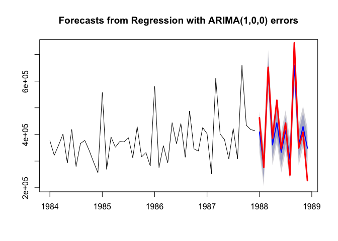

(Red line shows the forecast after multiply back the seasonal index)

Coefficient is higher for CP after adjusting for lag effect and transform into dollar amount scale. However, we also need to take into account of the diminishing marginal returns. If we spend too much on CP, promotions might result in negative effect on future period sales (more than 1 period comparing to what we get from our model). Furthermore, to make a more comprehensive decision, we need more information on the additional profits generated by promotion in order to calculate the net effect of the promotion, but because we don't have any information regarding marginal profit, we can assume Harmon is currently not losing money on promotions.

Overall, based on the information provided from the case and the model, they should focus on promotion with consumer packs, especially as Harmon is currently weighing consumer packs and dealer allowances equally. Harmon should remain cautious about the potential negative effect from presale, and future promotional costs.
