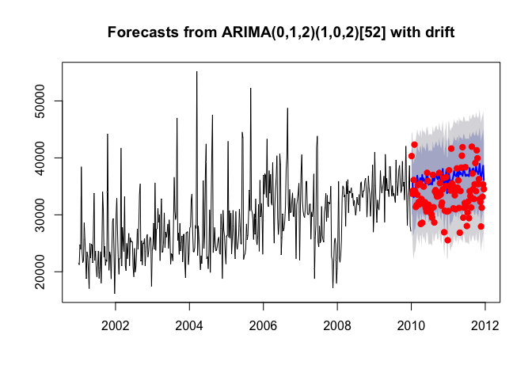

Setup
=====

``` r
#read in files
drug <- read.csv('data/PB-Drugstres-BOSTON.csv',row.names = 1)
grog <- read.csv('data/PB-GroceryStores-BOSTON.csv', row.names = 1)
upc <- read.csv('data/UPC information.csv')
```

Question 1
==========

data pre-processing
-------------------

### create new columns and aggreate data

``` r
#create new column for sales in lbs
drug$LBS <- drug$UNITS * drug$VOL_EQ
grog$LBS <- grog$UNITS * grog$VOL_EQ

#create new dataframe aggregate store level sales (only take week and sales(lbs))
drug_agg <- data.frame(subset(drug, select = c(WEEK, LBS)) 
                       %>% group_by(WEEK) 
                       %>% summarise(LBS = sum(LBS)))

grog_agg <- data.frame(subset(grog, select = c(WEEK, LBS)) 
                       %>% group_by(WEEK) 
                       %>% summarise(LBS = sum(LBS)))

iriweek = seq(1114,1740)
```

### convert dataframe to weekly level and monthly level sales time series

#### function to convert sales dataframe to monthly ts (first column of df is IRI week, second column is sales).

``` r
iri2m <- function(df, col.name){
  CW <- seq(as.POSIXct("1979-9-3", "GMT"), as.POSIXct("2012-12-31", "GMT"), by = "week")
  cal.ix <- CW[df[,1]]
  demand <- xts(df[,2], order.by=cal.ix)
  st.day <- first(cal.ix)
  end.day <- as.POSIXct(as.Date(last(cal.ix))+7)
  demd <- seq(st.day,end.day,"day")
  demd <- merge(demand,demd)
  demd <- na.locf(demd)/7
  mdem <- apply.monthly(demd,sum)
  mdem <- ts(mdem, start=c(as.numeric(format(as.Date(st.day),'%Y')),as.numeric(format(as.Date(st.day),'%m'))), frequency=12)
  colnames(mdem) <- col.name
  return(mdem)  
}
```

#### weekly level time series for sales(lbs) in drug stores, groceries and Boston

``` r
drug_ts_w <- ts(drug_agg$LBS, start = decimal_date(ymd("2001-01-01")), frequency = 365.25/7)
grog_ts_w <- ts(grog_agg$LBS, start = decimal_date(ymd("2001-01-01")), frequency = 365.25/7)
boston_ts_w <- drug_ts_w + grog_ts_w

par(mfrow = c(3,1))
plot(drug_ts_w,main ='drug store (weekly)') 
plot(grog_ts_w,main ='grocery store (weekly)') 
plot(boston_ts_w,main ='boston area (weekly)') 
```


The drugstore channel sales seems to be very noisy. The variance of the grocery store channel sales shrunk after 2008. It might be a good idea to perform a box cox transformation on the data. For the entire boston area sales, sales mainly came from grocery stores. We can also see that Boston's sales pattern is similar to the sales pattern of groceries stores, especially the fact that variance shrunk after 2008. It might be a good idea to also perform a box cox transformation on this data.

#### monthly level time series for sales(lbs) in drug stores, groceries and Boston

``` r
drug_ts_m <- iri2m(drug_agg, 'LBS')
grog_ts_m <- iri2m(grog_agg, 'LBS')
boston_ts_m <- drug_ts_m + grog_ts_m

par(mfrow = c(3,1))
plot(drug_ts_m, main ='drug store (monthly)') 
plot(grog_ts_m,main ='grocery store (monthly)') 
plot(boston_ts_m, main ='boston area (monthly)') 
```


The drug store sales at the monthly level are noisy, with increasing trend and increasing variance The grocery store sales are also noisy, with an increasing upward trend over time. Total sales for the Boston area were also noisy, with an increasing upward trend over time, likely influenced by grocery stores larger portion of total sales.

From our plots of sales at the channel level and total sales on a weekly and a monthly scale, we can arrive at some conclusions. Forecasting individual channels might not be better than forecasting at an aggregate level,since sales from drug stores were very noisy and only had "insignificant" amount compared to sales from grocery stores. Forecasting on weekly level will also be more noisy than forecasting on a monthly level. However, let's try all of them and see!

Following are the four models we proposed:

1.  weekly channel level forecast
2.  weekly Boston level forecast
3.  monthly channel level forecast
4.  monthly aggregate level forecast

weekly level sales forecast
---------------------------

### train test split

trainining(2001-2009), test(2010-2012)

``` r
drug_ts_w.tr <- window(drug_ts_w, end = 2009.99)
drug_ts_w.te <- window(drug_ts_w, start = 2010)

grog_ts_w.tr <- window(grog_ts_w, end = 2009.99)
grog_ts_w.te <- window(grog_ts_w, start = 2010)

boston_ts_w.tr <- window(boston_ts_w, end = 2009.99)
boston_ts_w.te <- window(boston_ts_w, start = 2010)
```

### model 1: weekly channel level forecast

#### drug stores

``` r
tsdisplay(drug_ts_w.tr)#increasing variance and non-stationary
```


``` r
#apply box-cox
la_drug_w <- BoxCox.lambda(drug_ts_w.tr)

m.AA_drug <- auto.arima(drug_ts_w.tr, lambda = la_drug_w)
summary(m.AA_drug)
```

    ## Series: drug_ts_w.tr 
    ## ARIMA(2,1,1)(0,0,1)[52] 
    ## Box Cox transformation: lambda= 0.2563951 
    ## 
    ## Coefficients:
    ##           ar1      ar2      ma1    sma1
    ##       -0.0727  -0.1346  -0.9280  0.1272
    ## s.e.   0.0499   0.0492   0.0207  0.0490
    ## 
    ## sigma^2 estimated as 4.808:  log likelihood=-1033.3
    ## AIC=2076.61   AICc=2076.74   BIC=2097.36
    ## 
    ## Training set error measures:
    ##                   ME     RMSE     MAE       MPE     MAPE      MASE
    ## Training set 17.6312 94.60935 52.3443 -23.40467 51.65509 0.7345667
    ##                     ACF1
    ## Training set -0.04823946

``` r
tsdiag(m.AA_drug)
```


``` r
f.AA_drug = forecast(m.AA_drug, h = 103)
plot(f.AA_drug)
points(drug_ts_w.te, col="red", pch=19) 
```


``` r
accuracy(f.AA_drug, drug_ts_w.te) 
```

    ##                   ME      RMSE      MAE        MPE     MAPE      MASE
    ## Training set 17.6312  94.60935  52.3443 -23.404675 51.65509 0.7345667
    ## Test set     80.8648 194.26800 109.7705   4.428628 42.91986 1.5404492
    ##                     ACF1 Theil's U
    ## Training set -0.04823946        NA
    ## Test set     -0.09179820  0.943389

From `tsdisplay`, we can determine the data has increasing variance therefore we applied the Box-Cox transformation. From the forecast alone, we can probably say that this arima model doesn't do a great job at predicitng the weekly sales in drug channel. Out-of-sample MASE is above 1 (although this is a 103 period forecast, still not doing a great job).

#### grocery stores

``` r
tsdisplay(grog_ts_w.tr)#increasing variance and non-stationary
```


``` r
#apply box-cox
la_grog_w <- BoxCox.lambda(grog_ts_w.tr)

m.AA_grog <- auto.arima(grog_ts_w.tr, lambda = la_grog_w)
summary(m.AA_grog)
```

    ## Series: grog_ts_w.tr 
    ## ARIMA(0,1,2)(0,0,2)[52] 
    ## Box Cox transformation: lambda= 1.739283 
    ## 
    ## Coefficients:
    ##           ma1      ma2    sma1    sma2
    ##       -0.7789  -0.1536  0.2349  0.1623
    ## s.e.   0.0464   0.0463  0.0465  0.0468
    ## 
    ## sigma^2 estimated as 1.094e+14:  log likelihood=-8247.41
    ## AIC=16504.82   AICc=16504.95   BIC=16525.57
    ## 
    ## Training set error measures:
    ##                     ME     RMSE      MAE       MPE     MAPE      MASE
    ## Training set -28.37639 4847.194 3499.559 -2.738586 12.32708 0.7625534
    ##                     ACF1
    ## Training set 0.007744106

``` r
tsdiag(m.AA_grog)
```


``` r
f.AA_grog = forecast(m.AA_grog, h = 103)
plot(f.AA_grog)
points(grog_ts_w.te, col="red", pch=19) 
```


``` r
accuracy(f.AA_grog, grog_ts_w.te)
```

    ##                       ME     RMSE      MAE       MPE     MAPE      MASE
    ## Training set   -28.37639 4847.194 3499.559 -2.738586 12.32708 0.7625534
    ## Test set     -1851.14228 3907.155 3233.675 -6.586745 10.08007 0.7046172
    ##                     ACF1 Theil's U
    ## Training set 0.007744106        NA
    ## Test set     0.319104669  1.001576

After applying the box-cox transformation to the grocery store data, we can determine that the data is mostly stationary with maybe a slight seasonal component. The forecast does a decent job predicting the data, mainly by predicting a steady forecast. Out-of-sample MASE is 0.705, also indicating the model is doing better than naive forecast.

#### sum channel forecasts and aggregate to monthly level forecast

``` r
f.channel_w = data.frame(iriweek[471:573], f.AA_drug$mean + f.AA_grog$mean)
colnames(f.channel_w) <- c("WEEK","LBS")
f.channel_w <- iri2m(f.channel_w,'LBS')
```

### model 2. weekly Boston level forecast

``` r
tsdisplay(boston_ts_w.tr)#increasing variance and non-stationary
```


``` r
#apply box-cox
la_boston_w <- BoxCox.lambda(boston_ts_w.tr)

m.AA_boston <- auto.arima(boston_ts_w.tr, lambda = la_boston_w)
summary(m.AA_boston)
```

    ## Series: boston_ts_w.tr 
    ## ARIMA(0,1,2)(1,0,2)[52] with drift 
    ## Box Cox transformation: lambda= 1.728253 
    ## 
    ## Coefficients:
    ##           ma1      ma2    sar1     sma1    sma2     drift
    ##       -0.7907  -0.1487  0.5735  -0.3303  0.0500  45687.73
    ## s.e.   0.0468   0.0473  0.1766   0.1810  0.0765  40626.09
    ## 
    ## sigma^2 estimated as 8.61e+13:  log likelihood=-8191.07
    ## AIC=16396.15   AICc=16396.39   BIC=16425.2
    ## 
    ## Training set error measures:
    ##                     ME     RMSE      MAE       MPE     MAPE      MASE
    ## Training set -287.5229 4818.183 3514.571 -3.635761 12.46421 0.7648607
    ##                   ACF1
    ## Training set 0.0108355

``` r
tsdiag(m.AA_boston)
```


``` r
f.AA_boston = forecast(m.AA_boston, h = 103)
plot(f.AA_boston)
points(boston_ts_w.te, col="red", pch=19)
```



``` r
accuracy(f.AA_boston, boston_ts_w.te) 
```

    ##                      ME     RMSE      MAE       MPE     MAPE      MASE
    ## Training set  -287.5229 4818.183 3514.571 -3.635761 12.46421 0.7648607
    ## Test set     -2843.8008 4445.449 3763.081 -9.491323 11.76309 0.8189429
    ##                   ACF1 Theil's U
    ## Training set 0.0108355        NA
    ## Test set     0.2918700   1.12332

After applying the box-cox transformation to the boston area data, we can determine that the data is mostly stationary with maybe a slight seasonal component (which is what we saw in the grocery store data). The forecast seems to be like a slight overestimate, but most points still fall with in the 80% confidence interval. Out-of-sample MASE is 0.82.

#### aggregate to monthly level forecast

``` r
#get monthly forecast
f.boston_w = data.frame(iriweek[471:573], f.AA_boston$mean)
colnames(f.boston_w) <- c("WEEK","LBS")
f.boston_w <- iri2m(f.boston_w,'LBS')
```

monthly level sales forecast
----------------------------

### train test split

``` r
#train test split
#trainining(2001-2009), test(2010-2012)
drug_ts_m.tr <- window(drug_ts_m, end = c(2009, 12))
drug_ts_m.te <- window(drug_ts_m, start = c(2010, 1))

grog_ts_m.tr <- window(grog_ts_m, end = c(2009, 12))
grog_ts_m.te <- window(grog_ts_m, start = c(2010, 1))

boston_ts_m.tr <- window(boston_ts_m, end = c(2009, 12))
boston_ts_m.te <- window(boston_ts_m, start = c(2010, 1))
```

### model 3: monthly channel level forecast

#### drug stores

``` r
#drug stores
tsdisplay(drug_ts_m.tr)#increasing variance and non-stationary
```


``` r
#apply box-cox
la_drug_m <- BoxCox.lambda(drug_ts_m.tr)

m.AA2_drug <- auto.arima(drug_ts_m.tr, lambda = la_drug_m)
summary(m.AA2_drug)
```

    ## Series: drug_ts_m.tr 
    ## ARIMA(2,1,1)(2,0,0)[12] 
    ## Box Cox transformation: lambda= 0.1823687 
    ## 
    ## Coefficients:
    ##           ar1     ar2      ma1    sar1    sar2
    ##       -0.0606  0.2584  -0.8869  0.1523  0.3794
    ## s.e.   0.1464  0.1420   0.0933  0.0967  0.1002
    ## 
    ## sigma^2 estimated as 1.23:  log likelihood=-163.22
    ## AIC=338.44   AICc=339.28   BIC=354.48
    ## 
    ## Training set error measures:
    ##                    ME     RMSE      MAE       MPE     MAPE      MASE
    ## Training set 27.84728 168.1796 119.3874 -5.218886 29.61653 0.6781462
    ##                    ACF1
    ## Training set 0.02480464

``` r
tsdiag(m.AA2_drug)
```


``` r
f.AA2_drug = forecast(m.AA2_drug, h = 24)
plot(f.AA2_drug)
points(drug_ts_m.te, col="red", pch=19) 
```


``` r
accuracy(f.AA2_drug, drug_ts_m.te) 
```

    ##                     ME     RMSE      MAE       MPE     MAPE      MASE
    ## Training set  27.84728 168.1796 119.3874 -5.218886 29.61653 0.6781462
    ## Test set     184.84378 364.1402 292.0420 10.523819 31.62531 1.6588615
    ##                    ACF1 Theil's U
    ## Training set 0.02480464        NA
    ## Test set     0.03132051  0.935104

The forecast here seems to do a better job fitting the data at the monthly level than at the weekly level for drug stores. Still the out of sample statistics are not that great.

#### grocery stores

``` r
tsdisplay(grog_ts_m.tr)#increasing trend and non-constant variance
```


``` r
#apply box-cox
la_grog_m <- BoxCox.lambda(grog_ts_m.tr)

m.AA2_grog <- auto.arima(grog_ts_m.tr, lambda = la_grog_m)
summary(m.AA2_grog)
```

    ## Series: grog_ts_m.tr 
    ## ARIMA(0,1,1)(0,0,2)[12] 
    ## Box Cox transformation: lambda= 0.7417843 
    ## 
    ## Coefficients:
    ##           ma1    sma1    sma2
    ##       -0.6642  0.2898  0.4144
    ## s.e.   0.0711  0.0946  0.1075
    ## 
    ## sigma^2 estimated as 317419:  log likelihood=-830.85
    ## AIC=1669.7   AICc=1670.09   BIC=1680.39
    ## 
    ## Training set error measures:
    ##                  ME     RMSE      MAE       MPE     MAPE      MASE
    ## Training set 1113.9 11439.45 9107.208 0.0598585 7.398327 0.6943285
    ##                     ACF1
    ## Training set -0.03545274

``` r
tsdiag(m.AA2_grog)
```


``` r
f.AA2_grog = forecast(m.AA2_grog, h = 24)
plot(f.AA2_grog)
points(grog_ts_m.te, col="red", pch=19) 
```


``` r
accuracy(f.AA2_grog, grog_ts_m.te) 
```

    ##                     ME     RMSE       MAE         MPE      MAPE      MASE
    ## Training set   1113.90 11439.45  9107.208   0.0598585  7.398327 0.6943285
    ## Test set     -21387.35 24406.37 22110.893 -15.3157570 15.780918 1.6857222
    ##                     ACF1 Theil's U
    ## Training set -0.03545274        NA
    ## Test set      0.10304809  1.813584

The forecast seems to be doing some serious overestimating. Out-of-sample MASE is not so good.

#### sum channel forecasts

``` r
#get aggregate monthly forecast 
f.channel_m = f.AA2_drug$mean + f.AA2_grog$mean
```

### model 4: monthly Boston level forecast

``` r
tsdisplay(boston_ts_m.tr)#increasing variance and non-stationary
```


``` r
#apply box-cox
la_boston_m <- BoxCox.lambda(boston_ts_m.tr)

m.AA2_boston <- auto.arima(boston_ts_m.tr, lambda = la_boston_m)
summary(m.AA2_boston)
```

    ## Series: boston_ts_m.tr 
    ## ARIMA(0,1,1)(0,0,2)[12] 
    ## Box Cox transformation: lambda= 0.7125368 
    ## 
    ## Coefficients:
    ##           ma1    sma1    sma2
    ##       -0.6642  0.2893  0.4130
    ## s.e.   0.0712  0.0946  0.1077
    ## 
    ## sigma^2 estimated as 160790:  log likelihood=-794.44
    ## AIC=1596.89   AICc=1597.28   BIC=1607.58
    ## 
    ## Training set error measures:
    ##                   ME     RMSE      MAE        MPE     MAPE      MASE
    ## Training set 1132.32 11486.27 9146.882 0.07086716 7.402579 0.6952112
    ##                    ACF1
    ## Training set -0.0356089

``` r
tsdiag(m.AA2_boston)
```


``` r
f.AA2_boston = forecast(m.AA2_boston, h = 24)
plot(f.AA2_boston)
points(boston_ts_m.te, col="red", pch=19) #again overestimating
```


``` r
accuracy(f.AA2_boston, boston_ts_m.te) #not good
```

    ##                     ME     RMSE       MAE          MPE      MAPE      MASE
    ## Training set   1132.32 11486.27  9146.882   0.07086716  7.402579 0.6952112
    ## Test set     -21253.01 24312.81 21967.725 -15.13184808 15.590048 1.6696630
    ##                    ACF1 Theil's U
    ## Training set -0.0356089        NA
    ## Test set      0.1058568   1.79326

``` r
mae_naive = accuracy(f.AA2_boston, boston_ts_m.te)[5]/accuracy(f.AA2_boston, boston_ts_m.te)[11]
```

Similar to grocery level forecast, the forecast for Boston market seems to be doing some serious overestimating.

``` r
#get monthly forecast
f.boston_m = f.AA2_boston$mean
```

model comparison
----------------

### forecast plots

``` r
par(mfrow = c(2,2))

#1. weekly channel level
plot(boston_ts_m.tr, xlim = c(2001, 2012), ylim = c(90000, 200000), main ='weekly channel level')
lines(f.channel_w, col = 'blue', lwd = 3)
points(boston_ts_m.te, col = 'red', pch = 19)

#2. weekly aggregate level
plot(boston_ts_m.tr, xlim = c(2001, 2012), ylim = c(90000, 200000), main = 'weekly Boston level')
lines(f.boston_w, col = 'blue', lwd = 3)
points(boston_ts_m.te, col = 'red', pch = 19)

#3. monthly channel level
plot(boston_ts_m.tr, xlim = c(2001, 2012), ylim = c(90000, 200000), main = 'monthly channel level')
lines(f.channel_m, col = 'blue', lwd = 3)
points(boston_ts_m.te, col = 'red', pch = 19)

#4. monthly aggregate level
plot(boston_ts_m.tr, xlim = c(2001, 2012), ylim = c(90000, 200000), main = 'monthly Boston level')
lines(f.boston_m, col = 'blue', lwd = 3)
points(boston_ts_m.te, col = 'red', pch = 19)
```


Both of the monthly forecast are consistently overestimating the actual points. The weekly forecast seem to be pretty identical in there trends.

### summary with out-of-sample stats

``` r
par(mfrow=c(1,1))

rmse.m1 <- accuracy(f.channel_w, boston_ts_m.te)[2]
rmse.m2 <- accuracy(f.boston_w, boston_ts_m.te)[2]
rmse.m3 <- accuracy(f.channel_m, boston_ts_m.te)[2]
rmse.m4 <- accuracy(f.boston_m, boston_ts_m.te)[2]

mase.m1 <- accuracy(f.channel_w, boston_ts_m.te)[3]/mae_naive
mase.m2 <- accuracy(f.boston_w, boston_ts_m.te)[3]/mae_naive
mase.m3 <- accuracy(f.channel_m, boston_ts_m.te)[3]/mae_naive
mase.m4 <- accuracy(f.boston_m, boston_ts_m.te)[3]/mae_naive

models <- c('weekly channel', 'weekly aggregate', 'monthly channel', 'monthly aggregate')

model_stats <- data.frame(cbind(models, c(rmse.m1, rmse.m2, rmse.m3, rmse.m4), c(mase.m1, mase.m2, mase.m3, mase.m4)))
colnames(model_stats) <- c('Model', 'Out-of-sample RMSE', 'Out-of-sample MASE')
pander(model_stats)
```

<table style="width:83%;">
<colgroup>
<col width="25%" />
<col width="29%" />
<col width="29%" />
</colgroup>
<thead>
<tr class="header">
<th align="center">Model</th>
<th align="center">Out-of-sample RMSE</th>
<th align="center">Out-of-sample MASE</th>
</tr>
</thead>
<tbody>
<tr class="odd">
<td align="center">weekly channel</td>
<td align="center">12248.6171699125</td>
<td align="center">0.804057767752992</td>
</tr>
<tr class="even">
<td align="center">weekly aggregate</td>
<td align="center">15224.8560309291</td>
<td align="center">1.01856746963414</td>
</tr>
<tr class="odd">
<td align="center">monthly channel</td>
<td align="center">24252.9565050802</td>
<td align="center">1.66455811564651</td>
</tr>
<tr class="even">
<td align="center">monthly aggregate</td>
<td align="center">24312.8118658723</td>
<td align="center">1.66966297598548</td>
</tr>
</tbody>
</table>

So after all of that, based off of both OOS RMSE and OOS MASE we will use **weekly channel level forecast** for peanut butter sales in the Boston area.

final forecast
--------------

### weekly channel level forecast

``` r
la_drug <- BoxCox.lambda(drug_ts_w)
m.drug <- auto.arima(drug_ts_w, lambda = la_drug)
f.drug = forecast(m.drug, h = 54) #start from 2011-12-26
plot(f.drug)
```


``` r
la_grog <- BoxCox.lambda(grog_ts_w)
m.grog <- auto.arima(grog_ts_w, lambda = la_grog)
f.grog = forecast(m.grog, h = 54) #start from 2011-12-26
plot(f.grog)
```


### aggregate to monthly forecast

``` r
f.final = data.frame(iriweek[574:627], f.drug$mean + f.grog$mean)
colnames(f.final) <- c("WEEK","LBS")
f.final <- window(iri2m(f.final,'LBS'), start = c(2012,1), end = c(2012,12))
print(f.final)
```

    ##           Jan      Feb      Mar      Apr      May      Jun      Jul
    ## 2012 154177.5 144581.0 152470.6 145129.6 156090.8 146496.4 148058.6
    ##           Aug      Sep      Oct      Nov      Dec
    ## 2012 153507.0 148909.7 156341.3 144644.4 151929.0

``` r
par(mfrow = c(1,1))
plot(boston_ts_m, xlim = c(2001, 2013), ylim = c(90000, 200000), ylab='agg channels', main = 'Final Forecast for 2012')
lines(f.final, col = 'blue', lwd = 3)
```


Question 2
==========

data pre-processing
-------------------

### isolate skippy products

``` r
skippy_upc <- upc[grepl("SKIPPY", upc$L5),]$X
drug_skippy <- drug[drug$UPC %in% skippy_upc, ]
grog_skippy <- grog[grog$UPC %in% skippy_upc, ]

#get price per sqrt(pound)
drug_skippy$PPP <- drug_skippy$PPU/sqrt(drug_skippy$VOL_EQ)
grog_skippy$PPP <- grog_skippy$PPU/sqrt(grog_skippy$VOL_EQ)
boston_skippy <- rbind(drug_skippy, grog_skippy)
```

Using price per sqrt(lbs) is important since price should grow less than linear with size (usually larger packages don't double in price)

### aggreate data

Next we need to create a new dataframe aggregating weekly average price per sqrt(lbs) (for all upc and stores) and for total sales(lbs).

``` r
#first calculate average ppp at upc level
#then calculate average ppp of all upc

drug_skippy_agg <- data.frame(subset(drug_skippy, select = c(WEEK,UPC, PPP, LBS)) 
                  %>% group_by(WEEK, UPC) 
                  %>% summarise(LBS = sum(LBS), 
                                PPP = mean(PPP)))

drug_skippy_agg <- data.frame(drug_skippy_agg
                              %>% group_by(WEEK) 
                              %>% summarise(LBS = sum(LBS), 
                                            PPP = mean(PPP)))

grog_skippy_agg <- data.frame(subset(grog_skippy, select = c(WEEK, UPC, PPP, LBS)) 
                              %>% group_by(WEEK, UPC) 
                              %>% summarise(LBS = sum(LBS), 
                                            PPP = mean(PPP)))
grog_skippy_agg <- data.frame(grog_skippy_agg
                              %>% group_by(WEEK) 
                              %>% summarise(LBS = sum(LBS), 
                                            PPP = mean(PPP)))

boston_skippy_agg <- data.frame(subset(boston_skippy, select = c(WEEK, UPC, PPP, LBS)) 
                              %>% group_by(WEEK, UPC) 
                              %>% summarise(LBS = sum(LBS), 
                                            PPP = mean(PPP)))
boston_skippy_agg <- data.frame(boston_skippy_agg
                              %>% group_by(WEEK) 
                              %>% summarise(LBS = sum(LBS), 
                                            PPP = mean(PPP)))
```

### get monthly peanut price and peanut butter price per sqrt(lbs)

#### function to convert price per sqrt(lbs) dataframe to monthly ts.

``` r
#get monthly average price per pound of peanut butter 
ppp2m <- function(df, col.name){
  CW <- seq(as.POSIXct("1979-9-3", "GMT"), as.POSIXct("2011-12-19", "GMT"), by = "week")
  cal.ix <- CW[df[,1]]
  demand <- xts(df[,3], order.by=cal.ix)
  st.day <- first(cal.ix)
  end.day <- as.POSIXct(as.Date(last(cal.ix))+7)
  demd <- seq(st.day,end.day,"day")
  demd <- merge(demand,demd)
  demd <- na.locf(demd)
  mdem <- apply.monthly(demd,mean)
  mdem <- ts(mdem, start=as.numeric(format(as.Date(st.day),'%Y')), frequency=12)
  colnames(mdem) <- col.name
  return(mdem)  
}
```

#### monthly level time series for price of peanut (metric ton) and price of peanut butter (sqrt(lbs))

``` r
peanut <- read.csv('data/peanuts.csv', header = TRUE, skip = 1)
peanut_price <- ts(peanut$Price, start = c(1997, 11), frequency = 12) #price per metric ton
pp <- window(peanut_price, start = c(2001, 1), end = c(2011,12))

PPP_drug <- ppp2m(drug_skippy_agg,'PPP')
PPP_grog <- ppp2m(grog_skippy_agg,'PPP')
PPP_boston <- ppp2m(boston_skippy_agg,'PPP')
```

``` r
par(mfrow = c(2,2))
plot(PPP_drug, main = 'price per pound (drug stores)')
plot(PPP_grog, main = 'price per pound (grocery stores)')
plot(PPP_boston, main = 'price per pound (all Boston)')
plot(pp, main = 'price per ton peanuts')
```


``` r
par(mfrow = c(1,1))
```

It seems at the grocery store level (and by extention) at the boston area level, there be some stronger correlation between peanut price and the price of peanut butter.

### create data matrix for peanut butter price up to 12 lags (months)

``` r
pp1 <- window(peanut_price, start = c(2000, 12), end = c(2011,11))
pp2 <- window(peanut_price, start = c(2000, 11), end = c(2011,10))
pp3 <- window(peanut_price, start = c(2000, 10), end = c(2011,9))
pp4 <- window(peanut_price, start = c(2000, 9), end = c(2011,8))
pp5 <- window(peanut_price, start = c(2000, 8), end = c(2011,7))
pp6 <- window(peanut_price, start = c(2000, 7), end = c(2011,6))
pp7 <- window(peanut_price, start = c(2000, 6), end = c(2011,5))
pp8 <- window(peanut_price, start = c(2000, 5), end = c(2011,4))
pp9 <- window(peanut_price, start = c(2000, 4), end = c(2011,3))
pp10 <- window(peanut_price, start = c(2000, 3), end = c(2011,2))
pp11 <- window(peanut_price, start = c(2000, 2), end = c(2011,1))
pp12 <- window(peanut_price, start = c(2000, 1), end = c(2010,12))

x <- as.matrix(data.frame(pp1, pp2, pp3,pp4, pp5,pp6, pp7,pp8, pp9, pp10, pp11, pp12))
x.tr <- x[1:108,]
x.te <- x[109:132,]
```

regression models of peanut price on peanut butter price
--------------------------------------------------------

### variable selection

#### drug store level

``` r
##drug
p_drug <- data.frame(PPP_drug)
p_drug.tr <- p_drug[1:108,]
p_drug.te <- p_drug[109:132,]

set.seed(1)
m.L <- cv.glmnet(x=x.tr, y=p_drug.tr,  alpha=1)
plot(m.L)
```


``` r
L.min <- m.L$lambda.min
L.1se <- m.L$lambda.1se
coefficients(m.L, s=c(L.min,L.1se))
```

    ## 13 x 2 sparse Matrix of class "dgCMatrix"
    ##                        1            2
    ## (Intercept) 1.7672454188 2.048871e+00
    ## pp1         0.0002835519 5.206469e-05
    ## pp2         .            .           
    ## pp3         0.0001040486 2.132805e-04
    ## pp4         .            .           
    ## pp5         .            .           
    ## pp6         .            .           
    ## pp7         .            .           
    ## pp8         .            .           
    ## pp9         .            .           
    ## pp10        .            .           
    ## pp11        .            .           
    ## pp12        0.0003539411 2.012554e-04

Peanut price at lag 1, 3 and 12 were selected from lasso regression.

#### grocery store level

``` r
##grocery
p_grog <- data.frame(PPP_grog)
p_grog.tr <- p_grog[1:108,]
p_grog.te <- p_grog[109:132,]

set.seed(1)
m.L <- cv.glmnet(x=x.tr, y=p_grog.tr,  alpha=1)
plot(m.L)
```


``` r
L.min <- m.L$lambda.min
L.1se <- m.L$lambda.1se
coefficients(m.L, s=c(L.min,L.1se))
```

    ## 13 x 2 sparse Matrix of class "dgCMatrix"
    ##                        1            2
    ## (Intercept) 2.1529563399 2.314129e+00
    ## pp1         0.0001577729 7.857755e-05
    ## pp2         .            .           
    ## pp3         .            .           
    ## pp4         .            .           
    ## pp5         .            .           
    ## pp6         .            .           
    ## pp7         .            .           
    ## pp8         .            .           
    ## pp9         .            .           
    ## pp10        .            .           
    ## pp11        .            .           
    ## pp12        0.0002790432 2.008728e-04

Peanut price at lag 1 and lag 12 were selected from lasso regression.

#### Boston level

``` r
p_boston <- data.frame(PPP_boston)
p_boston.tr <- p_boston[1:108,]
p_boston.te <- p_boston[109:132,]

set.seed(1)
m.L <- cv.glmnet(x=x.tr, y=p_boston.tr,  alpha=1)
plot(m.L)
```


``` r
L.min <- m.L$lambda.min
L.1se <- m.L$lambda.1se
coefficients(m.L, s=c(L.min,L.1se))
```

    ## 13 x 2 sparse Matrix of class "dgCMatrix"
    ##                        1            2
    ## (Intercept) 2.1491907234 2.313398e+00
    ## pp1         0.0001606174 7.993144e-05
    ## pp2         .            .           
    ## pp3         .            .           
    ## pp4         .            .           
    ## pp5         .            .           
    ## pp6         .            .           
    ## pp7         .            .           
    ## pp8         .            .           
    ## pp9         .            .           
    ## pp10        .            .           
    ## pp11        .            .           
    ## pp12        0.0002843522 2.047103e-04

Same as previous model, peanut price at lag 1 and lag 12 were selected from lasso regression.

#### create data matrix with reduced variables from lasso regression

we decided to use peanut price at lag 1, 3 and 12 for drug store level peanut butter prices, and peanut price at lag 1 and 12 for grocery store level and Boston level peanut butter prices in the regression model. We used a log-log regression model to examine the relationship between peanut price and peanut butter price.

``` r
xr_drug <- as.matrix(data.frame(log(pp1), log(pp3), log(pp12)))
xr_drug.tr <- xr_drug[1:108,]
xr_drug.te <- xr_drug[109:132,]

xr <- as.matrix(data.frame(log(pp1), log(pp12)))
xr.tr <- xr[1:108,]
xr.te <- xr[109:132,]
```

``` r
#linear regression on drug store level
m.peanut = lm(log(p_drug.tr)~xr_drug.tr)
summary(m.peanut)
```

    ## 
    ## Call:
    ## lm(formula = log(p_drug.tr) ~ xr_drug.tr)
    ## 
    ## Residuals:
    ##      Min       1Q   Median       3Q      Max 
    ## -0.32797 -0.04438  0.01287  0.04895  0.13942 
    ## 
    ## Coefficients:
    ##                     Estimate Std. Error t value Pr(>|t|)    
    ## (Intercept)         -1.39320    0.25307  -5.505 2.67e-07 ***
    ## xr_drug.trlog.pp1.   0.16826    0.10621   1.584 0.116181    
    ## xr_drug.trlog.pp3.   0.01282    0.11494   0.112 0.911432    
    ## xr_drug.trlog.pp12.  0.15436    0.04056   3.806 0.000239 ***
    ## ---
    ## Signif. codes:  0 '***' 0.001 '**' 0.01 '*' 0.05 '.' 0.1 ' ' 1
    ## 
    ## Residual standard error: 0.08029 on 104 degrees of freedom
    ## Multiple R-squared:   0.45,  Adjusted R-squared:  0.4341 
    ## F-statistic: 28.36 on 3 and 104 DF,  p-value: 1.76e-13

``` r
#linear regression on grocery store level
m.peanut = lm(log(p_grog.tr)~xr.tr)
summary(m.peanut)
```

    ## 
    ## Call:
    ## lm(formula = log(p_grog.tr) ~ xr.tr)
    ## 
    ## Residuals:
    ##       Min        1Q    Median        3Q       Max 
    ## -0.092091 -0.032671 -0.000505  0.025914  0.093370 
    ## 
    ## Coefficients:
    ##                Estimate Std. Error t value Pr(>|t|)    
    ## (Intercept)    -0.42975    0.13615  -3.156  0.00208 ** 
    ## xr.trlog.pp1.   0.10237    0.01952   5.244 8.20e-07 ***
    ## xr.trlog.pp12.  0.09805    0.01936   5.063 1.77e-06 ***
    ## ---
    ## Signif. codes:  0 '***' 0.001 '**' 0.01 '*' 0.05 '.' 0.1 ' ' 1
    ## 
    ## Residual standard error: 0.04347 on 105 degrees of freedom
    ## Multiple R-squared:  0.4958, Adjusted R-squared:  0.4862 
    ## F-statistic: 51.62 on 2 and 105 DF,  p-value: 2.438e-16

``` r
#linear regression on boston level
m.peanut = lm(log(p_boston.tr)~xr.tr)
summary(m.peanut)
```

    ## 
    ## Call:
    ## lm(formula = log(p_boston.tr) ~ xr.tr)
    ## 
    ## Residuals:
    ##       Min        1Q    Median        3Q       Max 
    ## -0.106239 -0.031731 -0.000052  0.027228  0.094402 
    ## 
    ## Coefficients:
    ##                Estimate Std. Error t value Pr(>|t|)    
    ## (Intercept)    -0.44968    0.13790  -3.261   0.0015 ** 
    ## xr.trlog.pp1.   0.10292    0.01977   5.205 9.68e-07 ***
    ## xr.trlog.pp12.  0.10064    0.01961   5.131 1.33e-06 ***
    ## ---
    ## Signif. codes:  0 '***' 0.001 '**' 0.01 '*' 0.05 '.' 0.1 ' ' 1
    ## 
    ## Residual standard error: 0.04402 on 105 degrees of freedom
    ## Multiple R-squared:  0.4972, Adjusted R-squared:  0.4876 
    ## F-statistic: 51.91 on 2 and 105 DF,  p-value: < 2.2e-16

Coefficient for peanut price at lag 3 in regression model for drug store peanut price is very insigificant. Hence, we decided to use peanut price at lag 1 and 12 for dynamic regression in question 3. We can see that on Boston level, 10% increase in peanut price (per ton) on average will have an impact of 1% increase in peanut butter price (per sqrt(lbs)) 1 month and 12 months later.

Question 3
==========

data pre-processing
-------------------

``` r
#get monthly aggregate sales
drug_skippy_ts <- iri2m(drug_skippy_agg,'LBS')
grog_skippy_ts <- iri2m(grog_skippy_agg,'LBS')
boston_skippy_ts <- iri2m(boston_skippy_agg,'LBS')

par(mfrow = c(3,1))
plot(drug_skippy_ts, main='skippy drugstore sales') 
plot(grog_skippy_ts, main='skippy grocery store sales') 
plot(boston_skippy_ts, main='skippy boston area sales') 
```


Following are the two models we proposed for forecasting peanut butter sales of "Skippy" products:

1.monthly channel level dynamic regression with peanut price at lag 1 and 12 2.monthly Boston level dynamic regression with peanut price at lag 1 and 12

models
------

### train test split

``` r
drug_skippy_ts.tr <- window(drug_skippy_ts, end = c(2009, 12))
drug_skippy_ts.te <- window(drug_skippy_ts, start = c(2010, 1))

grog_skippy_ts.tr <- window(grog_skippy_ts, end = c(2009, 12))
grog_skippy_ts.te <- window(grog_skippy_ts, start = c(2010, 1))

boston_skippy_ts.tr <- window(boston_skippy_ts, end = c(2009, 12))
boston_skippy_ts.te <- window(boston_skippy_ts, start = c(2010, 1))
```

### model 1: monthly channel level forecast

#### drugstores

``` r
m.AA_drug_skp <- auto.arima(drug_skippy_ts.tr, xreg = xr.tr)
summary(m.AA_drug_skp)
```

    ## Series: drug_skippy_ts.tr 
    ## Regression with ARIMA(2,1,1)(1,0,0)[12] errors 
    ## 
    ## Coefficients:
    ##           ar1     ar2      ma1    sar1   log.pp1.  log.pp12.
    ##       -0.0374  0.2379  -0.9114  0.2875  -144.8065   122.4278
    ## s.e.   0.1192  0.1225   0.0583  0.1200   114.7383   128.9437
    ## 
    ## sigma^2 estimated as 24056:  log likelihood=-689.64
    ## AIC=1393.28   AICc=1394.42   BIC=1411.99
    ## 
    ## Training set error measures:
    ##                    ME     RMSE      MAE       MPE     MAPE      MASE
    ## Training set 12.32547 149.9896 120.5903 -23.01641 51.14597 0.8096397
    ##                    ACF1
    ## Training set -0.0189959

``` r
tsdisplay(diff(arima.errors(m.AA_drug_skp)))#good
```

    ## Deprecated, use residuals.Arima(object, type='regression') instead


``` r
tsdiag(m.AA_drug_skp)#good
```


``` r
f.AA_drug_skp = forecast(m.AA_drug_skp, xreg = xr.te, h = 24)
plot(f.AA_drug_skp)
points(drug_skippy_ts.te, col="red", pch=19) #not bad
```


``` r
accuracy(f.AA_drug_skp, drug_skippy_ts.te) #out-of-sample stats not so good
```

    ##                     ME     RMSE      MAE        MPE     MAPE      MASE
    ## Training set  12.32547 149.9896 120.5903 -23.016410 51.14597 0.8096397
    ## Test set     120.82807 307.7158 258.3613  -3.763352 50.02985 1.7346297
    ##                     ACF1 Theil's U
    ## Training set -0.01899590        NA
    ## Test set      0.05727613 0.8791779

Visually the forecast seems to do an average job forecasting the points. The OOS are much less foregiving and show that this is not a great forecast.

#### grocery stores

``` r
m.AA_grog_skp <- auto.arima(grog_skippy_ts.tr, xreg = xr.tr)
summary(m.AA_grog_skp)
```

    ## Series: grog_skippy_ts.tr 
    ## Regression with ARIMA(2,1,2)(2,0,0)[12] errors 
    ## 
    ## Coefficients:
    ##           ar1      ar2     ma1      ma2    sar1    sar2    log.pp1.
    ##       -1.1269  -0.4202  0.0414  -0.6330  0.2484  0.2077  -11669.308
    ## s.e.   0.1302   0.1245  0.1449   0.1581  0.0943  0.0994    4744.597
    ##       log.pp12.
    ##        3223.914
    ## s.e.   4878.916
    ## 
    ## sigma^2 estimated as 55587465:  log likelihood=-1103.82
    ## AIC=2225.64   AICc=2227.49   BIC=2249.69
    ## 
    ## Training set error measures:
    ##                    ME     RMSE      MAE        MPE     MAPE      MASE
    ## Training set 671.2552 7138.289 5449.513 -0.6919444 11.61402 0.6664903
    ##                    ACF1
    ## Training set 0.01105639

``` r
tsdisplay(diff(arima.errors(m.AA_grog_skp)))#good
```

    ## Deprecated, use residuals.Arima(object, type='regression') instead


``` r
tsdiag(m.AA_grog_skp)#fine (some problem at lag 8-10)
```


``` r
f.AA_grog_skp = forecast(m.AA_grog_skp, xreg = xr.te, h = 24)
plot(f.AA_grog_skp)
points(grog_skippy_ts.te, col="red", pch=19) #looks fine
```


``` r
accuracy(f.AA_grog_skp, grog_skippy_ts.te) #good
```

    ##                      ME     RMSE      MAE        MPE     MAPE      MASE
    ## Training set   671.2552 7138.289 5449.513 -0.6919444 11.61402 0.6664903
    ## Test set     -3323.0572 7317.353 6133.257 -8.1786889 12.62117 0.7501141
    ##                    ACF1 Theil's U
    ## Training set 0.01105639        NA
    ## Test set     0.05803275 0.7824409

From the forecast plot, it seems like the forecast does a pretty good job picking up the declining price trend. OOS statistics are decent as well.

#### sum channel level forecasts

``` r
#get aggregate monthly forecast 
f.channel_skp = f.AA_drug_skp$mean + f.AA_grog_skp$mean
```

### model 2: monthly aggregate level forecast

``` r
m.AA_boston_skp <- auto.arima(boston_skippy_ts.tr, xreg = xr.tr)
summary(m.AA_boston_skp)
```

    ## Series: boston_skippy_ts.tr 
    ## Regression with ARIMA(2,1,2)(2,0,0)[12] errors 
    ## 
    ## Coefficients:
    ##           ar1      ar2     ma1      ma2    sar1    sar2    log.pp1.
    ##       -1.1320  -0.4249  0.0524  -0.6247  0.2487  0.2083  -11726.945
    ## s.e.   0.1304   0.1258  0.1480   0.1615  0.0941  0.0994    4909.161
    ##       log.pp12.
    ##        3275.385
    ## s.e.   4987.111
    ## 
    ## sigma^2 estimated as 55873847:  log likelihood=-1104.08
    ## AIC=2226.17   AICc=2228.03   BIC=2250.23
    ## 
    ## Training set error measures:
    ##                    ME     RMSE      MAE        MPE     MAPE      MASE
    ## Training set 643.6965 7156.654 5442.776 -0.7425683 11.52949 0.6629509
    ##                    ACF1
    ## Training set 0.01108573

``` r
f.AA_boston_skp = forecast(m.AA_boston_skp, xreg = xr.te, h = 24)
plot(f.AA_boston_skp)
points(boston_skippy_ts.te, col="red", pch=19) #fine
```


``` r
accuracy(f.AA_boston_skp, boston_skippy_ts.te) #good good
```

    ##                      ME     RMSE      MAE        MPE     MAPE      MASE
    ## Training set   643.6965 7156.654 5442.776 -0.7425683 11.52949 0.6629509
    ## Test set     -3228.9313 7282.577 6042.590 -7.9088069 12.32411 0.7360105
    ##                    ACF1 Theil's U
    ## Training set 0.01108573        NA
    ## Test set     0.03693590 0.7646421

``` r
mae_naive_skp = accuracy(f.AA_boston_skp, boston_skippy_ts.te)[5]/accuracy(f.AA_boston_skp, boston_skippy_ts.te)[11]
```

From the forecast plot, it seems like the forecast does a pretty good job picking up the declining price trend. OOS statistics are pretty good here.

``` r
#get monthly forecast
f.boston_skp = f.AA_boston_skp$mean
```

model comparison
----------------

### forecast plots

``` r
par(mfrow = c(2,1))

#1. monthly channel level
plot(boston_skippy_ts.tr, xlim = c(2001, 2012), ylim = c(30000, 80000), main ='monthly channel level')
lines(f.channel_skp, col = 'blue', lwd = 3)
points(boston_skippy_ts.te, col = 'red', pch = 19)

#2. monthly aggregate level
plot(boston_skippy_ts.tr, xlim = c(2001, 2012), ylim = c(30000, 80000), main ='monthly aggregate level')
lines(f.boston_skp, col = 'blue', lwd = 3)
points(boston_skippy_ts.te, col = 'red', pch = 19)
```


``` r
par(mfrow=c(1,1))
```

Visually, the forecasts seem to be pretty similar in shapes.

### summary with out-of-sample stats

``` r
rmse.m1 <- accuracy(f.channel_skp, boston_skippy_ts.te)[2]
rmse.m2 <- accuracy(f.boston_skp, boston_skippy_ts.te)[2]

mase.m1 <- accuracy(f.channel_skp, boston_skippy_ts.te)[3]/mae_naive_skp
mase.m2 <- accuracy(f.boston_skp, boston_skippy_ts.te)[3]/mae_naive_skp

models <- c('monthly channel', 'monthly aggregate')

model_stats <- data.frame(cbind(models, c(rmse.m1, rmse.m2), c(mase.m1, mase.m2)))
colnames(model_stats) <- c('Model', 'Out-of-sample RMSE', 'Out-of-sample MASE')
pander(model_stats)
```

<table style="width:83%;">
<colgroup>
<col width="25%" />
<col width="29%" />
<col width="29%" />
</colgroup>
<thead>
<tr class="header">
<th align="center">Model</th>
<th align="center">Out-of-sample RMSE</th>
<th align="center">Out-of-sample MASE</th>
</tr>
</thead>
<tbody>
<tr class="odd">
<td align="center">monthly channel</td>
<td align="center">7261.63316299102</td>
<td align="center">0.733510796070242</td>
</tr>
<tr class="even">
<td align="center">monthly aggregate</td>
<td align="center">7282.57697289114</td>
<td align="center">0.736010453231579</td>
</tr>
</tbody>
</table>

Since the OOS RMSE and OOS MASE are relatively close, it seems apropos to use monthly Boston level forecast, as it explains more of the data without being that much worse of a prediction.

final forecast
--------------

### fit the model with all available data

``` r
m.final_skp <- auto.arima(boston_skippy_ts, xreg = xr)
summary(m.final_skp)
```

    ## Series: boston_skippy_ts 
    ## Regression with ARIMA(2,1,2)(2,0,0)[12] errors 
    ## 
    ## Coefficients:
    ##           ar1      ar2      ma1      ma2    sar1    sar2    log.pp1.
    ##       -1.0487  -0.3484  -0.0200  -0.7017  0.2883  0.1713  -13238.617
    ## s.e.   0.1135   0.0968   0.0975   0.0987  0.0896  0.0939    3145.457
    ##       log.pp12.
    ##        4299.014
    ## s.e.   3633.387
    ## 
    ## sigma^2 estimated as 53719216:  log likelihood=-1349.7
    ## AIC=2717.41   AICc=2718.9   BIC=2743.29
    ## 
    ## Training set error measures:
    ##                    ME     RMSE     MAE        MPE     MAPE      MASE
    ## Training set 576.3034 7075.065 5522.52 -0.7688184 11.54779 0.6991319
    ##                     ACF1
    ## Training set 0.005942047

### get peanut butter lag price for future 12 months

For peanut price at lag 12, we have all the available information; however, we only have 1 month available peanut price at lag 1 at the moment of forecasting. Hence, we decided to use peanut price at Dec 2011 as naive forecast for peanut price in period Jan - Nov 2012.

``` r
f.pp1 <- ts(rep(c(window(peanut_price, start = c(2011, 12), end = c(2011,12))),12), start = c(2011,12), freq = 12)
f.pp12 <- window(peanut_price, start = c(2011, 1), end = c(2011,12))
f.xr <- as.matrix(data.frame(log(f.pp1), log(f.pp12)))
```

### get final forecast

``` r
f.final_skp = forecast(m.final_skp, xreg = f.xr, h = 12)
print(f.final_skp$mean)
```

    ##           Jan      Feb      Mar      Apr      May      Jun      Jul
    ## 2012 50056.62 48343.69 43144.19 43608.18 50334.05 47841.10 43091.20
    ##           Aug      Sep      Oct      Nov      Dec
    ## 2012 47443.43 44441.45 47903.93 45916.81 45858.48

``` r
plot(f.final_skp )
```


