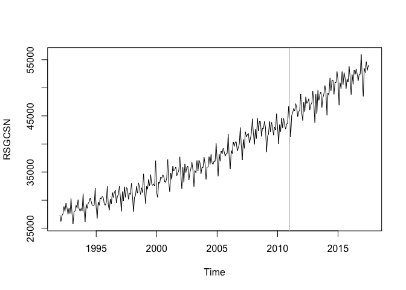
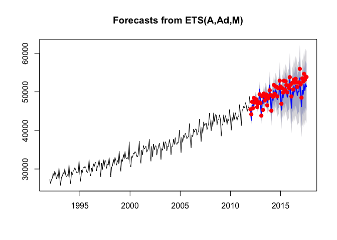
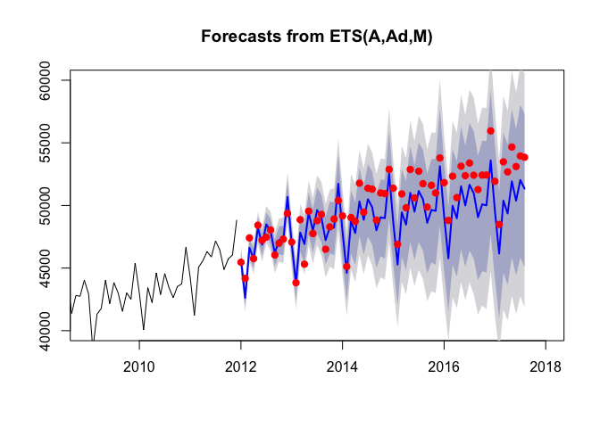
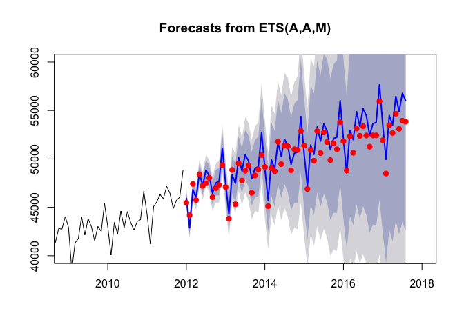
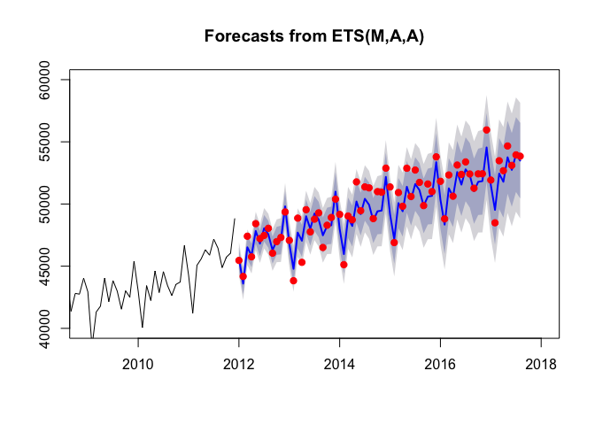
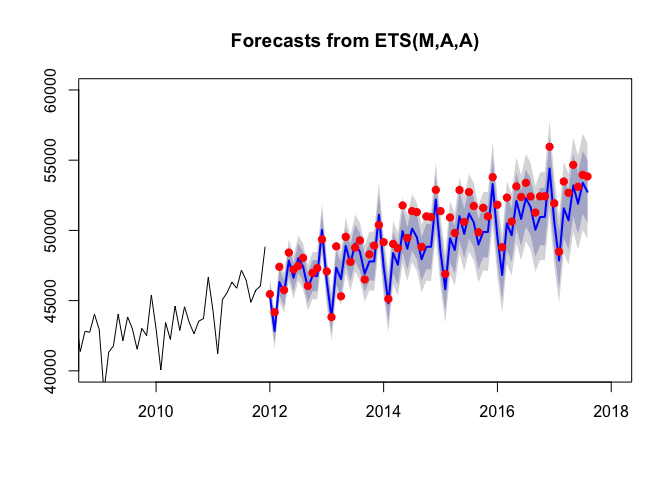
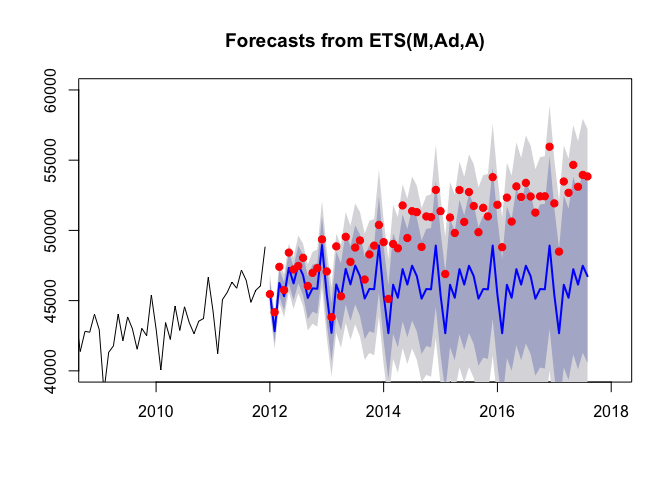
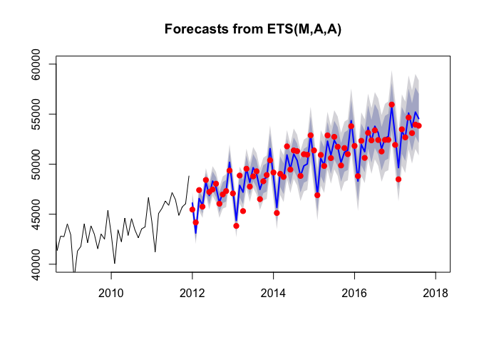
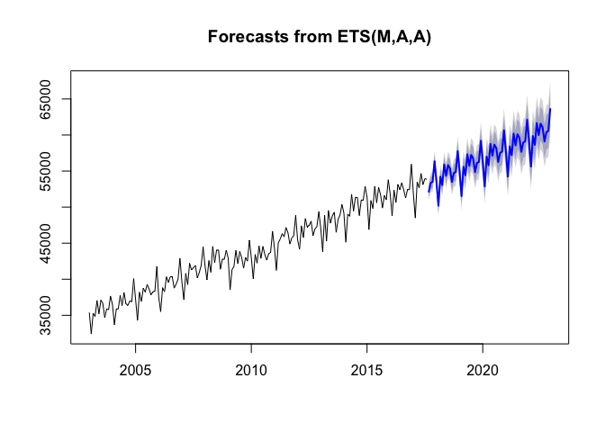

Setup
-----

``` r
setwd("/Users/meganchen/Desktop/UT\ Austin/supply\ chain/hw/hw1")

library(fpp)
library(dplyr)

RS <- read.csv("RSGCSN.csv") %>%
  select(-DATE) %>%
  ts(start= c(1992,1), frequency=12)

tr <- window(RS, end=c(2011,12))
te <- window(RS, start=c(2012,1))
plot(RS)
abline(v=c(2011,12), col="grey")
```



Question 1
----------

``` r
f.HW <- ets(tr, model="AAM", restrict =FALSE)
summary(f.HW)
```

    ## ETS(A,Ad,M) 
    ## 
    ## Call:
    ##  ets(y = tr, model = "AAM", restrict = FALSE) 
    ## 
    ##   Smoothing parameters:
    ##     alpha = 0.2604 
    ##     beta  = 0.0352 
    ##     gamma = 1e-04 
    ##     phi   = 0.9773 
    ## 
    ##   Initial states:
    ##     l = 27872.6554 
    ##     b = 51.6424 
    ##     s=1.0665 0.9957 0.9982 0.9782 1.017 1.0313
    ##            0.999 1.0303 0.9799 1.0008 0.9174 0.9856
    ## 
    ##   sigma:  535.0611
    ## 
    ##      AIC     AICc      BIC 
    ## 4366.896 4369.991 4429.548 
    ## 
    ## Training set error measures:
    ##                    ME     RMSE      MAE       MPE     MAPE      MASE
    ## Training set 50.63423 535.0611 412.6889 0.1190334 1.175391 0.4067623
    ##                    ACF1
    ## Training set -0.2637045

``` r
fc.HW <- forecast(f.HW, h=68)
plot(fc.HW)
points(te, col="red", pch=19)
```



``` r
plot(fc.HW, xlim=c(2009,2018), ylim=c(40000,60000))
points(te, col="red", pch=19)
```



``` r
accuracy(fc.HW, te)
```

    ##                      ME      RMSE       MAE       MPE     MAPE      MASE
    ## Training set   50.63423  535.0611  412.6889 0.1190334 1.175391 0.4067623
    ## Test set     1114.01135 1614.8850 1340.8976 2.1517677 2.626992 1.3216410
    ##                    ACF1 Theil's U
    ## Training set -0.2637045        NA
    ## Test set      0.6409933 0.6517983

Based on the the plotted forecasts and out-of-sample MPE we can see that the forecast are downward biased. Out-of-sample MAE = 1340.8967 and out-of-sample MASE = 1.321541, suggesting naive forecast is providing better estimates (MAE for naive forecast will be 1340.8967/1.321641 = 1014.57).

Question 2
----------

``` r
f.HW2 <- ets(tr, model="AAM", damped=FALSE, restrict=FALSE)
summary(f.HW2)
```

    ## ETS(A,A,M) 
    ## 
    ## Call:
    ##  ets(y = tr, model = "AAM", damped = FALSE, restrict = FALSE) 
    ## 
    ##   Smoothing parameters:
    ##     alpha = 0.2309 
    ##     beta  = 0.0548 
    ##     gamma = 1e-04 
    ## 
    ##   Initial states:
    ##     l = 27872.6548 
    ##     b = 39.6952 
    ##     s=1.0656 0.9963 0.9961 0.9763 1.0161 1.0324
    ##            1.0006 1.0314 0.9793 1.0003 0.9189 0.9868
    ## 
    ##   sigma:  539.3223
    ## 
    ##      AIC     AICc      BIC 
    ## 4368.704 4371.460 4427.875 
    ## 
    ## Training set error measures:
    ##                    ME     RMSE      MAE         MPE     MAPE      MASE
    ## Training set 7.459114 539.3223 424.2015 0.002428398 1.208207 0.4181095
    ##                    ACF1
    ## Training set -0.2116462

``` r
fc.HW2 <- forecast(f.HW2, h=68)
plot(fc.HW2, xlim=c(2009,2018), ylim=c(40000,60000))
points(te, col="red", pch=19)
```



``` r
accuracy(fc.HW2, te)
```

    ##                       ME      RMSE      MAE          MPE     MAPE
    ## Training set    7.459114  539.3223 424.2015  0.002428398 1.208207
    ## Test set     -818.368078 1156.6407 948.5997 -1.602851573 1.874100
    ##                   MASE       ACF1 Theil's U
    ## Training set 0.4181095 -0.2116462        NA
    ## Test set     0.9349769  0.2732119 0.4707054

Choose `f.HW2` (Holt-Winters no damping) since out-of-sample MASE is below 1, suggesting it is providing better estimates than naive forecast (from previous question we showed that naive forecast is providing better estimates than `f.HW`).

Forecasting cone is smaller for model1 because damping term reduces the standard error as forecasting period increases and hence decreases the confidence interval.

Question 3
----------

``` r
f.O <- ets(tr, model="ZZZ", restrict=FALSE)
summary(f.O)
```

    ## ETS(M,A,A) 
    ## 
    ## Call:
    ##  ets(y = tr, model = "ZZZ", restrict = FALSE) 
    ## 
    ##   Smoothing parameters:
    ##     alpha = 0.236 
    ##     beta  = 0.0039 
    ##     gamma = 0.0023 
    ## 
    ##   Initial states:
    ##     l = 27993.6515 
    ##     b = 50.6138 
    ##     s=2422.773 -185.2055 -145.3778 -792.2986 575.7059 1157.738
    ##            24.5534 1137.507 -735.0461 25.3615 -2791.01 -694.7011
    ## 
    ##   sigma:  0.0149
    ## 
    ##      AIC     AICc      BIC 
    ## 4351.995 4354.751 4411.165 
    ## 
    ## Training set error measures:
    ##                   ME    RMSE      MAE       MPE     MAPE      MASE
    ## Training set 51.6301 528.882 407.0936 0.1137527 1.155015 0.4012474
    ##                    ACF1
    ## Training set -0.2414475

``` r
fc.O <- forecast(f.O, h=68)
plot(fc.O, xlim=c(2009,2018), ylim=c(40000,60000))
points(te, col="red", pch=19)
```



``` r
accuracy(fc.O, te)
```

    ##                    ME    RMSE      MAE       MPE     MAPE      MASE
    ## Training set  51.6301 528.882 407.0936 0.1137527 1.155015 0.4012474
    ## Test set     414.1077 824.554 670.8440 0.7841938 1.334828 0.6612101
    ##                    ACF1 Theil's U
    ## Training set -0.2414475        NA
    ## Test set     -0.1113043 0.3423287

`f.O` has lowest out-of-sample MAE (0.66 MASE suggesting model MAE is lower that naive forecasts MAE as well) and AICc, BIC thus far, hence we should choose `f.O` for forecasting among all the models analyzed thus far.

Question 4
----------

``` r
L <- BoxCox.lambda(tr)
fB.O <- ets(tr, model="ZZZ", restrict=FALSE, lambda=L)
summary(fB.O)
```

    ## ETS(M,A,A) 
    ## 
    ## Call:
    ##  ets(y = tr, model = "ZZZ", lambda = L, restrict = FALSE) 
    ## 
    ##   Box-Cox transformation: lambda= 0.4125 
    ## 
    ##   Smoothing parameters:
    ##     alpha = 0.2539 
    ##     beta  = 1e-04 
    ##     gamma = 1e-04 
    ## 
    ##   Initial states:
    ##     l = 162.9948 
    ##     b = 0.1533 
    ##     s=5.2425 -0.4039 -0.2528 -1.673 1.2563 2.4717
    ##            0.1208 2.4657 -1.5866 0.0298 -6.2827 -1.3877
    ## 
    ##   sigma:  0.0061
    ## 
    ##      AIC     AICc      BIC 
    ## 1389.165 1391.922 1448.336 
    ## 
    ## Training set error measures:
    ##                    ME     RMSE      MAE         MPE    MAPE      MASE
    ## Training set 16.19076 517.4893 394.0639 0.002165623 1.12071 0.3884048
    ##                    ACF1
    ## Training set -0.2668116

``` r
fBc.O <- forecast(fB.O, h=68)
plot(fBc.O, xlim=c(2009,2018), ylim=c(40000,60000))
points(te, col="red", pch=19)
```



``` r
accuracy(fBc.O, te)
```

    ##                     ME      RMSE       MAE         MPE     MAPE      MASE
    ## Training set  16.19076  517.4893  394.0639 0.002165623 1.120710 0.3884048
    ## Test set     972.04951 1244.6954 1086.2439 1.902816350 2.142824 1.0706444
    ##                    ACF1 Theil's U
    ## Training set -0.2668116        NA
    ## Test set      0.1870965 0.5110618

`f.O` has slightly higher in-sample MAE than `fB.O`, however, out-of-sample MAE for `fB.O` is much higher than `f.O`. Hence, so far, `f.O` would be chosen for forecasting.

Question 5
----------

``` r
fB.OD <- ets(tr, model="ZZZ", damped=TRUE, restrict=FALSE, lambda=L)
summary(fB.OD)
```

    ## ETS(M,Ad,A) 
    ## 
    ## Call:
    ##  ets(y = tr, model = "ZZZ", damped = TRUE, lambda = L, restrict = FALSE) 
    ## 
    ##   Box-Cox transformation: lambda= 0.4125 
    ## 
    ##   Smoothing parameters:
    ##     alpha = 0.1367 
    ##     beta  = 0.1293 
    ##     gamma = 0.001 
    ##     phi   = 0.864 
    ## 
    ##   Initial states:
    ##     l = 162.6686 
    ##     b = 0.2858 
    ##     s=5.1384 -0.4422 -0.4055 -1.6623 1.2633 2.596
    ##            0.1787 2.1511 -1.5417 0.1534 -6.2644 -1.1649
    ## 
    ##   sigma:  0.0061
    ## 
    ##      AIC     AICc      BIC 
    ## 1394.817 1397.912 1457.468 
    ## 
    ## Training set error measures:
    ##                    ME     RMSE      MAE       MPE     MAPE      MASE
    ## Training set 76.46805 521.7953 410.4162 0.1956192 1.159424 0.4045223
    ##                    ACF1
    ## Training set -0.2281849

``` r
fBc.OD <- forecast(fB.OD, h=68)
plot(fBc.OD, xlim=c(2009,2018), ylim=c(40000,60000))
points(te, col="red", pch=19)
```



``` r
accuracy(fBc.OD, te)
```

    ##                      ME      RMSE       MAE       MPE     MAPE      MASE
    ## Training set   76.46805  521.7953  410.4162 0.1956192 1.159424 0.4045223
    ## Test set     3944.64965 4538.3606 3950.6278 7.7039752 7.716893 3.8938931
    ##                    ACF1 Theil's U
    ## Training set -0.2281849        NA
    ## Test set      0.8636960  1.831121

In-sample MAE: `fB.O` &lt; `f.O` &lt; `fB.OD`

Out-of-sample MAE: `f.O` &lt; `fB.O` &lt; `fB.OD`

The trend from the plot looks linear, which could be one of the potential reason adding damping constant is not helping. Out of these three models, we should choose `f.O`.

Question 6
----------

``` r
tr_start <- c(1992:2006)
n <- length(tr_start)
out_rmse <- rep(0,n)

for (i in 1:n) {
  tr_m <- window(RS, start=tr_start[i], end=c(2011,12))
  L_m <- BoxCox.lambda(tr_m)
  fB.O_m <- ets(tr_m, model="MAA", damped=FALSE, restrict=FALSE, lambda=L_m)
  rmse = sqrt(mean((fB.O_m$fitted - tr_m)^2))
  out_rmse[i] = rmse
}

year_best <- tr_start[which.min(out_rmse)]
year_best
```

    ## [1] 2003

``` r
rmse_best <- out_rmse[which.min(out_rmse)]
rmse_best
```

    ## [1] 494.1545

``` r
trr <- window(RS, start=year_best, end=c(2011,12))
```

We cannot use AICc and BIC criteria to choose best starting year since both criteria should be used to compare the model constructed based on the same dataset. Here, since the starting point is moving, the underlying dataset is changing with the starting date, hence we cannot use AICc or BIC to choose the best starting year.

Question 7
----------

``` r
Lr <- BoxCox.lambda(trr)
f <- ets(trr, model="MAA", damped=FALSE, restrict=FALSE, lambda=Lr)
summary(f)
```

    ## ETS(M,A,A) 
    ## 
    ## Call:
    ##  ets(y = trr, model = "MAA", damped = FALSE, lambda = Lr, restrict = FALSE) 
    ## 
    ##   Box-Cox transformation: lambda= 0.5078 
    ## 
    ##   Smoothing parameters:
    ##     alpha = 0.3437 
    ##     beta  = 1e-04 
    ##     gamma = 1e-04 
    ## 
    ##   Initial states:
    ##     l = 399.3291 
    ##     b = 0.5507 
    ##     s=12.9335 -0.5228 -0.9083 -5.3871 2.8785 6.4737
    ##            -0.1923 7.1417 -3.9767 -0.0233 -17.2089 -1.208
    ## 
    ##   sigma:  0.0062
    ## 
    ##      AIC     AICc      BIC 
    ## 749.5679 756.3679 795.1641 
    ## 
    ## Training set error measures:
    ##                    ME     RMSE     MAE        MPE      MAPE      MASE
    ## Training set 1.138946 494.1545 372.665 -0.0121768 0.9224311 0.2750316
    ##                    ACF1
    ## Training set -0.1857008

``` r
fc <- forecast(f, h=68)
plot(fc, xlim=c(2009,2018), ylim=c(40000,60000))
points(te, col="red", pch=19)
```



``` r
accuracy(fc, te)
```

    ##                      ME     RMSE      MAE        MPE      MAPE      MASE
    ## Training set   1.138946 494.1545 372.6650 -0.0121768 0.9224311 0.2750316
    ## Test set     -89.304138 627.4568 495.1071 -0.1852254 0.9977177 0.3653955
    ##                     ACF1 Theil's U
    ## Training set -0.18570080        NA
    ## Test set      0.01993697 0.2604248

In-sample AICc for `f.O` is not comparable with the in-sample AICc for `f` because they are constructed using different data

In-sample MASE for `f.O` is not comparable with the in-sample MASE for `f` since they have differenct training sets, hence differenct MAE for naive forecasts.

Out-of-sample RMSE for `f.O` is comparable with the out-of-sample RMSE for `f` because they are on the same scale and have the same prediction period. `fc` forecast is truly an out-of-sample forecast because `f` is constructed base on the time-series ending in Dec 2011, the reduction in training set does not affect the the forecasting period.

Question 8
----------

``` r
tr_agg <- window(RS, start=year_best)
L_agg <- BoxCox.lambda(tr_agg)
ff <- ets(tr_agg, model="MAA", damped=FALSE, restrict=FALSE, lambda=L_agg)
summary(ff)
```

    ## ETS(M,A,A) 
    ## 
    ## Call:
    ##  ets(y = tr_agg, model = "MAA", damped = FALSE, lambda = L_agg,  
    ## 
    ##  Call:
    ##      restrict = FALSE) 
    ## 
    ##   Box-Cox transformation: lambda= 0.4567 
    ## 
    ##   Smoothing parameters:
    ##     alpha = 0.3032 
    ##     beta  = 1e-04 
    ##     gamma = 1e-04 
    ## 
    ##   Initial states:
    ##     l = 259.201 
    ##     b = 0.3068 
    ##     s=7.0959 -0.1654 -0.2683 -3.286 2.0433 3.5779
    ##            -0.0704 4.4208 -2.9312 0.4932 -10.1614 -0.7483
    ## 
    ##   sigma:  0.0056
    ## 
    ##      AIC     AICc      BIC 
    ## 1109.554 1113.428 1163.452 
    ## 
    ## Training set error measures:
    ##                      ME     RMSE     MAE          MPE      MAPE      MASE
    ## Training set -0.9217158 533.2781 418.213 -0.009882169 0.9504666 0.3131409
    ##                    ACF1
    ## Training set -0.2077653

``` r
ffc <- forecast(ff, h=64)
plot(ffc)
```



Based on result from previous question and the in-sample statistics, out-of-sample MAPE over the next five years will be around 1%, out-of-sample RMSE over the next five years will be aroung 700.
