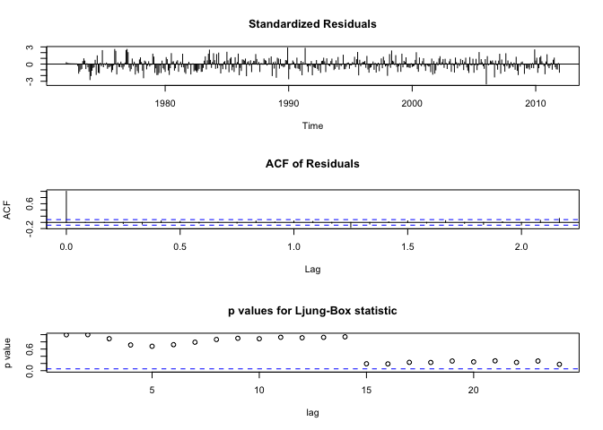
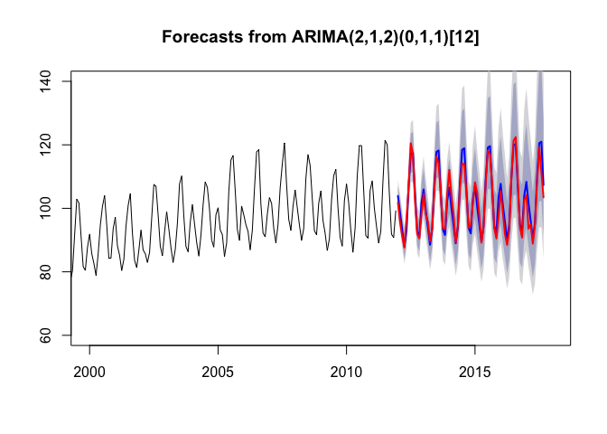

Setup
-----

``` r
setwd('~/Desktop/UT\ Austin/supply\ chain/hw/hw2')

library(fpp)
library(dplyr)
PG <- read.csv("IPG2211N.csv") %>%
  select(-DATE) %>%
  ts(start=c(1972,1), frequency=12)

PG1.tr <- window(PG, end=c(1995,12))
PG1.te <- window(PG, start=c(1996,1), end=c(2000,12))
```

Question 1
----------

``` r
La1 <- BoxCox.lambda(PG1.tr)
tsdisplay(diff(BoxCox(PG1.tr,La1)), lag=48)
```


The process looks stationary.

``` r
tsdisplay(diff(BoxCox(PG1.tr,La1),12), lag=48)
```


The process has some unstableness in variance, overall looks stationary.

``` r
tsdisplay(diff(diff(BoxCox(PG1.tr,La1),12)), lag=48)
```


The process looks stationary.

``` r
adf.test(diff(BoxCox(PG1.tr,La1)))
```

    ## Warning in adf.test(diff(BoxCox(PG1.tr, La1))): p-value smaller than
    ## printed p-value

    ## 
    ##  Augmented Dickey-Fuller Test
    ## 
    ## data:  diff(BoxCox(PG1.tr, La1))
    ## Dickey-Fuller = -8.2734, Lag order = 6, p-value = 0.01
    ## alternative hypothesis: stationary

p-value is less than 0.01, test result indicates the transformed series with a non-seasonal difference is stationary.

``` r
adf.test(diff(BoxCox(PG1.tr,La1),12))
```

    ## Warning in adf.test(diff(BoxCox(PG1.tr, La1), 12)): p-value smaller than
    ## printed p-value

    ## 
    ##  Augmented Dickey-Fuller Test
    ## 
    ## data:  diff(BoxCox(PG1.tr, La1), 12)
    ## Dickey-Fuller = -4.8586, Lag order = 6, p-value = 0.01
    ## alternative hypothesis: stationary

p-value is less than 0.01, test result indicates the transformed series with a seasonal difference is stationary.

``` r
adf.test(diff(diff(BoxCox(PG1.tr,La1),12)))
```

    ## Warning in adf.test(diff(diff(BoxCox(PG1.tr, La1), 12))): p-value smaller
    ## than printed p-value

    ## 
    ##  Augmented Dickey-Fuller Test
    ## 
    ## data:  diff(diff(BoxCox(PG1.tr, La1), 12))
    ## Dickey-Fuller = -7.9688, Lag order = 6, p-value = 0.01
    ## alternative hypothesis: stationary

p-value is less than 0.01, test result indicates the transformed series with a non-seasonal difference and a seasonal difference is stationary.

For the above three series, maximum order of p, q, P, Q are as following: - p = 5, q = 0, P = 3, Q = 0 - p = 6, q = 0, P = 2, Q = 1 - p = 4, q = 6, P = 3, Q = 2

Question 2
----------

``` r
fit.AA <- auto.arima(PG1.tr, lambda = La1)
summary(fit.AA)
```

    ## Series: PG1.tr 
    ## ARIMA(1,1,2)(0,1,1)[12] 
    ## Box Cox transformation: lambda= -0.2542538 
    ## 
    ## Coefficients:
    ##          ar1      ma1      ma2     sma1
    ##       0.3733  -0.4466  -0.2637  -0.7941
    ## s.e.  0.1541   0.1522   0.0728   0.0476
    ## 
    ## sigma^2 estimated as 4.947e-05:  log likelihood=969.56
    ## AIC=-1929.12   AICc=-1928.89   BIC=-1911.03
    ## 
    ## Training set error measures:
    ##                       ME     RMSE       MAE        MPE    MAPE      MASE
    ## Training set -0.09697521 1.179734 0.8761734 -0.2013992 1.48562 0.3886194
    ##                    ACF1
    ## Training set -0.1091666

``` r
tsdiag(fit.AA, gof.lag=24)
```


A few residual exceeds the significance level, p-value not high enough.

``` r
fc.AA <- forecast(fit.AA, h=60)
plot(fc.AA, xlim=c(1990,2001), ylim=c(60,140))
lines(PG1.te, col="red", lwd = 2)
```


``` r
accuracy(fc.AA, PG1.te)
```

    ##                       ME     RMSE       MAE        MPE     MAPE      MASE
    ## Training set -0.09697521 1.179734 0.8761734 -0.2013992 1.485620 0.3886194
    ## Test set     -2.03164696 2.895616 2.4081906 -2.4293395 2.872239 1.0681328
    ##                    ACF1 Theil's U
    ## Training set -0.1091666        NA
    ## Test set      0.5831711 0.4666031

Forecasts are upward biased (higher than actual value)

Question 3
----------

``` r
p = c(0:6)
q = c(0)
P = c(0:2)
Q = c(0:1)
comb = expand.grid(p,q,P,Q)
nset = nrow(comb)
BIC = rep(0,nset)

for (i in 1:nset){
  try(fit.1 <- Arima(PG1.tr, order=c(comb[i,1],0,comb[i,2]), seasonal=c(comb[i,3],1,comb[i,4]), lambda=La1),TRUE)
  BIC[i] = BIC(fit.1)
}

best = unlist(comb[which.min(BIC),])
print(best)
```

    ## Var1 Var2 Var3 Var4 
    ##    5    0    0    1

``` r
fit.1 <- Arima(PG1.tr, order=c(best[1],0,best[2]),seasonal=c(best[3],1,best[4]), lambda=La1)
summary(fit.1)
```

    ## Series: PG1.tr 
    ## ARIMA(5,0,0)(0,1,1)[12] 
    ## Box Cox transformation: lambda= -0.2542538 
    ## 
    ## Coefficients:
    ##          ar1      ar2     ar3     ar4     ar5     sma1
    ##       0.9345  -0.2072  0.0826  0.0131  0.1749  -0.8157
    ## s.e.  0.0608   0.0828  0.0830  0.0823  0.0610   0.0488
    ## 
    ## sigma^2 estimated as 4.885e-05:  log likelihood=974.48
    ## AIC=-1934.96   AICc=-1934.54   BIC=-1909.61
    ## 
    ## Training set error measures:
    ##                       ME     RMSE      MAE       MPE     MAPE      MASE
    ## Training set -0.02227341 1.167795 0.861372 -0.042308 1.465826 0.3820543
    ##                    ACF1
    ## Training set -0.1042676

The model has lower AICc and BIC than the one found by `auto.arima(...)`.

Question 4
----------

``` r
p = c(0:5)
q = c(0:0)
P = c(0:3)
Q = c(0:0)
comb = expand.grid(p,q,P,Q)
nset = nrow(comb)
BIC = rep(0,nset)

for (i in 1:nset){
  try(fit.2 <- Arima(PG1.tr, order=c(comb[i,1],1,comb[i,2]), seasonal=c(comb[i,3],0,comb[i,4]), lambda=La1),TRUE)
  BIC[i] = BIC(fit.2)
}

best = unlist(comb[which.min(BIC),])
print(best)
```

    ## Var1 Var2 Var3 Var4 
    ##    4    0    3    0

``` r
fit.2 <- Arima(PG1.tr, order=c(best[1],1,best[2]),seasonal=c(best[3],0,best[4]), lambda=La1)
summary(fit.2)
```

    ## Series: PG1.tr 
    ## ARIMA(4,1,0)(3,0,0)[12] 
    ## Box Cox transformation: lambda= -0.2542538 
    ## 
    ## Coefficients:
    ##           ar1      ar2      ar3      ar4    sar1    sar2    sar3
    ##       -0.0630  -0.2930  -0.2068  -0.1704  0.3925  0.1826  0.3751
    ## s.e.   0.0599   0.0576   0.0592   0.0603  0.0573  0.0634  0.0580
    ## 
    ## sigma^2 estimated as 5.335e-05:  log likelihood=994.84
    ## AIC=-1973.69   AICc=-1973.17   BIC=-1944.41
    ## 
    ## Training set error measures:
    ##                         ME     RMSE       MAE         MPE     MAPE
    ## Training set -0.0009289983 1.235707 0.9151634 -0.04186909 1.564221
    ##                   MASE       ACF1
    ## Training set 0.4059131 -0.1078324

The model has lower AICc and BIC than the one found by `auto.arima(...)` and model from question 3.

Question 5
----------

``` r
PG2.tr <- window(PG, end=c(2011,12))
PG2.te <- window(PG, start=c(2012,1))

La2 <- BoxCox.lambda(PG2.tr)
```

``` r
adf.test(diff(diff(BoxCox(PG2.tr,La2),12)))
```

    ## Warning in adf.test(diff(diff(BoxCox(PG2.tr, La2), 12))): p-value smaller
    ## than printed p-value

    ## 
    ##  Augmented Dickey-Fuller Test
    ## 
    ## data:  diff(diff(BoxCox(PG2.tr, La2), 12))
    ## Dickey-Fuller = -9.768, Lag order = 7, p-value = 0.01
    ## alternative hypothesis: stationary

p-value is less than 0.01, test result indicates the transformed series with a non-seasonal difference and a seasonal difference is stationary.

``` r
tsdisplay(diff(diff(BoxCox(PG2.tr,La2),12)), lag=48)
```


Based on ACF and PACF, the maximum order of p, q, P and Q will be 4,2,0,2, respectively.

Question 6
----------

``` r
fit.AA2 <- auto.arima(PG2.tr, lambda = La2)
summary(fit.AA2)
```

    ## Series: PG2.tr 
    ## ARIMA(2,1,2)(0,1,1)[12] 
    ## Box Cox transformation: lambda= -0.3623298 
    ## 
    ## Coefficients:
    ##          ar1     ar2      ma1      ma2     sma1
    ##       0.0494  0.2194  -0.1943  -0.5151  -0.7817
    ## s.e.  0.1692  0.1437   0.1556   0.1480   0.0319
    ## 
    ## sigma^2 estimated as 1.878e-05:  log likelihood=1876.48
    ## AIC=-3740.96   AICc=-3740.78   BIC=-3716.08
    ## 
    ## Training set error measures:
    ##                      ME     RMSE      MAE        MPE     MAPE      MASE
    ## Training set -0.1270695 1.559354 1.136589 -0.2102917 1.537755 0.4589151
    ##                    ACF1
    ## Training set -0.1105239

``` r
tsdiag(fit.AA2, gof.lag=24)
```



A few residual exceeds the significance level, p-value not high enough

``` r
fc.AA2 <- forecast(fit.AA2, h=69)
plot(fc.AA2, xlim=c(2000,2018), ylim=c(60,140))
lines(PG2.te, col="red", lwd = 2)
```



``` r
accuracy(fc.AA2, PG2.te)
```

    ##                      ME     RMSE      MAE        MPE     MAPE      MASE
    ## Training set -0.1270695 1.559354 1.136589 -0.2102917 1.537755 0.4589151
    ## Test set     -0.8180414 2.788739 2.125495 -0.8162788 2.073699 0.8582009
    ##                    ACF1 Theil's U
    ## Training set -0.1105239        NA
    ## Test set      0.5016556 0.3206488

Forecasts are not very biased

Question 7
----------

``` r
PG3.tr <- window(PG, start=c(2005,1), end=c(2011,12))
fit.AA3 <- auto.arima(PG3.tr)
summary(fit.AA3)
```

    ## Series: PG3.tr 
    ## ARIMA(0,0,1)(2,1,1)[12] 
    ## 
    ## Coefficients:
    ##          ma1     sar1    sar2     sma1
    ##       0.6714  -0.0817  -0.252  -0.6307
    ## s.e.  0.0867   0.2992   0.197   0.3639
    ## 
    ## sigma^2 estimated as 5.376:  log likelihood=-166.48
    ## AIC=342.96   AICc=343.87   BIC=354.34
    ## 
    ## Training set error measures:
    ##                     ME     RMSE     MAE       MPE     MAPE      MASE
    ## Training set 0.4052349 2.086235 1.57698 0.3751014 1.551031 0.5667358
    ##                    ACF1
    ## Training set 0.06007128

``` r
tsdiag(fit.AA3, gof.lag=24)
```


Only one residual is slightly higher above 0.5 significance line, most of the p-values are high.

``` r
tsdisplay(diff(PG3.tr), lag=48) 
```


``` r
tsdisplay(diff(PG3.tr,12), lag=48) 
```


``` r
tsdisplay(diff(diff(PG3.tr,12)), lag=48) 
```


``` r
fit.3 <- Arima(PG3.tr, order=c(2,1,2),seasonal=c(2,1,1))
summary(fit.3)
```

    ## Series: PG3.tr 
    ## ARIMA(2,1,2)(2,1,1)[12] 
    ## 
    ## Coefficients:
    ##           ar1     ar2     ma1      ma2    sar1     sar2     sma1
    ##       -0.0375  0.0796  -0.177  -0.5748  0.0813  -0.0921  -0.9994
    ## s.e.   0.3069  0.2987   0.277   0.3069  0.1505   0.1640   0.5054
    ## 
    ## sigma^2 estimated as 4.753:  log likelihood=-164.58
    ## AIC=345.15   AICc=347.47   BIC=363.25
    ## 
    ## Training set error measures:
    ##                       ME     RMSE      MAE        MPE     MAPE     MASE
    ## Training set -0.08486429 1.902894 1.394302 -0.1046757 1.369239 0.501085
    ##                    ACF1
    ## Training set 0.01656463

``` r
tsdiag(fit.3, gof.lag=24)
```


Only one residual is slightly higher above 0.5 significance line, most of the p-values are high.

``` r
fc.3 <- forecast(fit.3, h=69)
plot(fc.3, xlim=c(2005,2018), ylim=c(60,140))
lines(PG2.te, col="red", lwd = 2)
```


``` r
accuracy(fc.3, PG2.te)
```

    ##                       ME     RMSE      MAE        MPE     MAPE      MASE
    ## Training set -0.08486429 1.902894 1.394302 -0.1046757 1.369239 0.5010850
    ## Test set     -0.52909853 2.646563 1.999165 -0.5533215 1.950987 0.7184607
    ##                    ACF1 Theil's U
    ## Training set 0.01656463        NA
    ## Test set     0.42767038 0.3044445

``` r
accuracy(fc.AA2, PG2.te)
```

    ##                      ME     RMSE      MAE        MPE     MAPE      MASE
    ## Training set -0.1270695 1.559354 1.136589 -0.2102917 1.537755 0.4589151
    ## Test set     -0.8180414 2.788739 2.125495 -0.8162788 2.073699 0.8582009
    ##                    ACF1 Theil's U
    ## Training set -0.1105239        NA
    ## Test set      0.5016556 0.3206488

Out-of-sample RMSE for the model in this question is lower than the best model from question 6. We can't use AICc or BIC to compare two models since we don't have the same training set for two models.

Question 8
----------

``` r
PG.tr <- window(PG, start=c(2005,1))
fit.4 <- Arima(PG.tr, order=c(2,1,2),seasonal=c(1,1,1))
summary(fit.4)
```

    ## Series: PG.tr 
    ## ARIMA(2,1,2)(1,1,1)[12] 
    ## 
    ## Coefficients:
    ##          ar1     ar2      ma1      ma2    sar1     sma1
    ##       0.2080  0.1554  -0.6160  -0.3840  0.1555  -0.9367
    ## s.e.  0.5425  0.3200   0.5363   0.5345  0.1181   0.2287
    ## 
    ## sigma^2 estimated as 5.143:  log likelihood=-322.99
    ## AIC=659.98   AICc=660.83   BIC=680.57
    ## 
    ## Training set error measures:
    ##                      ME     RMSE      MAE        MPE     MAPE      MASE
    ## Training set -0.1790093 2.122396 1.637294 -0.2028999 1.603164 0.6077448
    ##                      ACF1
    ## Training set -0.002153052

``` r
tsdiag(fit.4, gof.lag=24)
```


Most of the p-values are high, the residuals are random.

``` r
fc.4 <- forecast(fit.4, h=63)
plot(fc.4)
```


