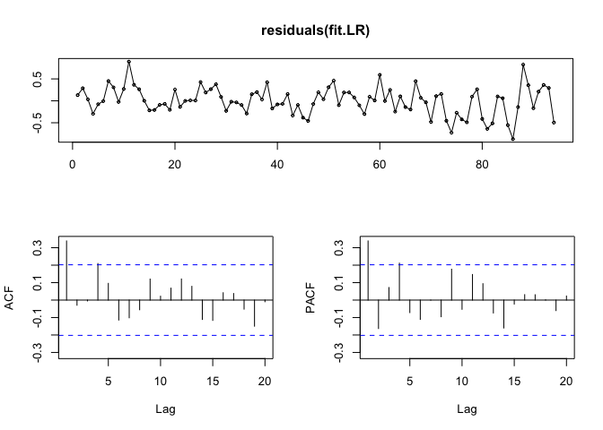
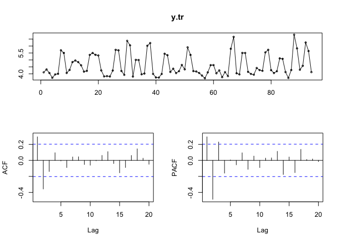
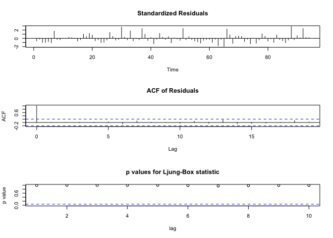
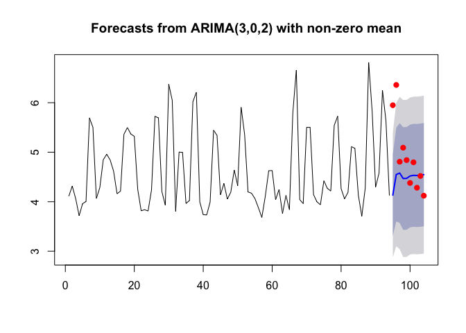
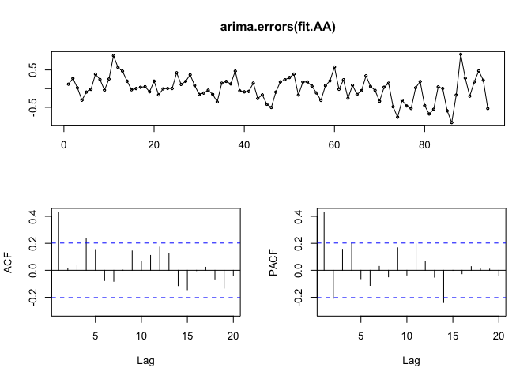
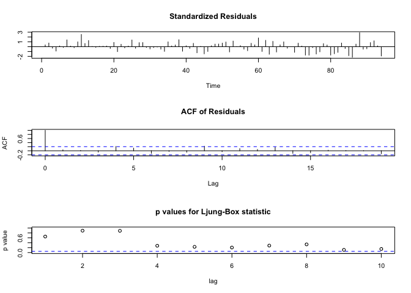
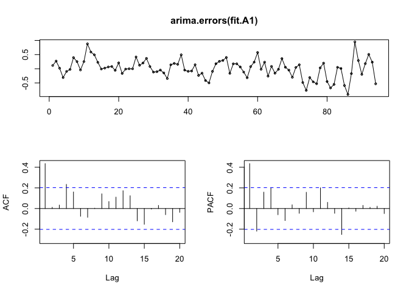
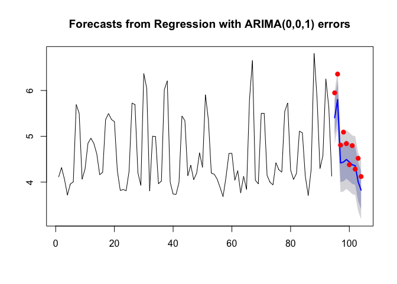

Setup
-----

``` r
setwd('~/Desktop/UT\ Austin/supply\ chain/hw/hw3')

library(fpp)
library(reshape)
library(dplyr)
library(glmnet)

#
PBS <- read.csv("Peanut Butter Chicago.csv")[,-1] %>% 
  mutate( F_LSA=ifelse(F=="A",1,0),   # Large Size Ad Dummy
          F_MSA=ifelse(F=="B",1,0),   # Medium Size Ad Dummy
          F_SSA=ifelse(F=="C",1,0),   # Small Size Ad Dummy
          D_MIN=ifelse(D==1,1,0),     # Minor In-Store Display Dummy
          D_MAJ=ifelse(D==2,1,0)) %>% # Major In-Store Display Dummy
  # Promotional variables are weighted by sales volume (oz)
  mutate(S_LB = UNITS * VOL_EQ,
         WF_LSA = F_LSA * UNITS * VOL_EQ,     # Large Size Ad Weighted
         WF_MSA = F_MSA * UNITS * VOL_EQ,     # Medium Size Ad Weighted
         WF_SSA = F_SSA * UNITS * VOL_EQ,     # Small Size Ad Weighted
         WD_MIN = D_MIN * UNITS * VOL_EQ,     # Minor In-Store Display Weighted
         WD_MAJ = D_MAJ * UNITS * VOL_EQ) %>% # Major In-Store Display Weighted
  mutate(VEND =ifelse(VEND == 48001,"SK",ifelse( VEND == 99998,"PL","OB"))) %>%
  select(-F, -D)

# Create aggregate variables by product-week
x.pw <- group_by(PBS, WEEK, VEND) %>% 
  summarise(S.DOLLARS = sum(DOLLARS),      # Total $ Sales 
            S.S_LB    = sum(S_LB),         # Total L. Sales
            S.WF_LSA  = sum(WF_LSA),       # Total Weighted Large Ad
            S.WF_MSA  = sum(WF_MSA),       # Total Weighted Medium Ad
            S.WF_SSA  = sum(WF_SSA),       # Total Weighted Small Ad
            S.WD_MIN  = sum(WD_MIN),       # Total Weighted Minor Store Disp
            S.WD_MAJ  = sum(WD_MAJ)) %>%   # Total Weighted Major Store Disp
  # Calculate weigted averages of Advertising and Promotion variables
  mutate(A.PPU = log(S.DOLLARS / S.S_LB),  # Avg. Price per unit (pound)
         S.WF_LSA  = S.WF_LSA / S.S_LB,    # Avg. Weighted Large Ad
         S.WF_MSA  = S.WF_MSA / S.S_LB,    # Avg. Weighted Medium Ad
         S.WF_SSA  = S.WF_SSA / S.S_LB,    # Avg. Weighted Small Ad
         S.WD_MIN  = S.WD_MIN / S.S_LB,    # Avg. Weighted Minor Store Disp
         S.WD_MAJ  = S.WD_MAJ / S.S_LB)    # Avg. Weighted Major Store Disp
#


xmat <- x.pw %>%
  mutate(LS  = log(S.S_LB)) %>% 
  select(-S.DOLLARS, -S.S_LB)
#
# Creeate separate columns for vars of each brand group
xmat <- data.frame(filter(xmat, VEND == "SK"),
                   filter(xmat, VEND == "OB"),
                   filter(xmat, VEND == "PL")) %>%
  select(-WEEK, -WEEK.1, -WEEK.2, 
         -VEND, -VEND.1, -VEND.2, 
         -LS.1, -LS.2) # After droping vars. you should have 19 vars left

#
xm <- model.matrix(LS ~., data=xmat)[,-1]
y <- xmat[,"LS"]
y <- ts(y)
#

set.seed(1)
xm.tr = xm[1:94,]
xm.te = xm[95:104,]
y.tr = y[1:94]
y.te = y[95:104]
```

Question 1
----------

``` r
grid = 10^seq(3,-3,length = 100)
cv.lasso = cv.glmnet(xm.tr, y.tr, alpha = 1, lambda = grid)
bestlam.lasso = cv.lasso$lambda.min

fit.lasso = glmnet(xm.tr, y.tr, alpha = 1, lambda = bestlam.lasso, intercept = TRUE)
print(fit.lasso$a0)
```

    ##       s0 
    ## 6.759449

``` r
xm_s = subset(xm,select = c('S.WD_MIN', 'A.PPU'))
xm_s.tr = xm_s[1:94,]
xm_s.te = xm_s[95:104,]
```

After apply 10-fold cross-validation on Lasso regression with best regularization hyperparameter, the shrunk model has non-zero coefficient on `S.WD_MIN` and `A.PPU`, with coefficients of 0.4824377 and -2.4255044, repectively. The reduced set of predictive variables obtained is `xm_s`.

Question 2
----------

``` r
fit.LR <- lm(y.tr ~ xm_s.tr)
summary(fit.LR)
```

    ## 
    ## Call:
    ## lm(formula = y.tr ~ xm_s.tr)
    ## 
    ## Residuals:
    ##      Min       1Q   Median       3Q      Max 
    ## -0.87268 -0.19213  0.00467  0.19773  0.89398 
    ## 
    ## Coefficients:
    ##                 Estimate Std. Error t value Pr(>|t|)    
    ## (Intercept)       6.8563     0.1248  54.950  < 2e-16 ***
    ## xm_s.trS.WD_MIN   0.5741     0.0947   6.063 2.99e-08 ***
    ## xm_s.trA.PPU     -2.5493     0.1279 -19.937  < 2e-16 ***
    ## ---
    ## Signif. codes:  0 '***' 0.001 '**' 0.01 '*' 0.05 '.' 0.1 ' ' 1
    ## 
    ## Residual standard error: 0.3202 on 91 degrees of freedom
    ## Multiple R-squared:  0.8423, Adjusted R-squared:  0.8388 
    ## F-statistic:   243 on 2 and 91 DF,  p-value: < 2.2e-16

``` r
tsdisplay(residuals(fit.LR))
```



OLS regression was fitted on the reduced dataset, coefficients obtained for `S.WD_MIN` and `A.PPU` are 0.5741 and -2.5493, respectively.

ACF and PACF plots for residual show that there exist significant auto-correlation.

Question 3
----------

``` r
y <- ts(y)
y.tr = window(y, end = 94)
y.te = window(y, start = 95)

tsdisplay(y.tr)
```



``` r
adf.test(y.tr)
```

    ## Warning in adf.test(y.tr): p-value smaller than printed p-value

    ## 
    ##  Augmented Dickey-Fuller Test
    ## 
    ## data:  y.tr
    ## Dickey-Fuller = -4.7333, Lag order = 4, p-value = 0.01
    ## alternative hypothesis: stationary

``` r
fit.AM <- Arima(y.tr, order = c(3,0,2))
summary(fit.AM)
```

    ## Series: y.tr 
    ## ARIMA(3,0,2) with non-zero mean 
    ## 
    ## Coefficients:
    ##          ar1      ar2     ar3      ma1      ma2    mean
    ##       0.9427  -0.3371  0.2799  -0.3739  -0.6261  4.6194
    ## s.e.  0.1905   0.2774  0.1459   0.1960   0.1948  0.0251
    ## 
    ## sigma^2 estimated as 0.4063:  log likelihood=-89.28
    ## AIC=192.57   AICc=193.87   BIC=210.37
    ## 
    ## Training set error measures:
    ##                        ME      RMSE       MAE       MPE     MAPE      MASE
    ## Training set -0.008183289 0.6167702 0.4673403 -1.818738 9.933411 0.7162223
    ##                     ACF1
    ## Training set 0.001316539

``` r
tsdiag(fit.AM, gof.lag=10)
```



Based on the ACF and PACF plots of the log-of-sales-volumn data, an ARIMA(3,0,2) was fitted. Diagnostic plot on the residual of the model is shown above, the p-values for Ljung-Box test are very high, suggesting residuals are stationary i.i.d. observations.

Question 4
----------

``` r
plot(forecast(fit.AM, h=10))
points(y.te, col="red", pch=19)
```



As shown, point predictions are not very accurate, two of them are outside of 90% confidence interval. Also, confidence interval has large margin of error, which is not very helpful.

Question 5
----------

``` r
fit.AA <- auto.arima(y.tr, xreg = xm_s.tr)
summary(fit.AA)
```

    ## Series: y.tr 
    ## Regression with ARIMA(0,0,1) errors 
    ## 
    ## Coefficients:
    ##          ma1  intercept  S.WD_MIN    A.PPU
    ##       0.5109     6.9871    0.3591  -2.6548
    ## s.e.  0.0942     0.1340    0.0928   0.1341
    ## 
    ## sigma^2 estimated as 0.08464:  log likelihood=-15.43
    ## AIC=40.86   AICc=41.54   BIC=53.58
    ## 
    ## Training set error measures:
    ##                        ME      RMSE       MAE        MPE     MAPE
    ## Training set -0.000157446 0.2846773 0.2242023 -0.3514288 4.941856
    ##                   MASE       ACF1
    ## Training set 0.3436012 0.04571852

``` r
tsdisplay(arima.errors(fit.AA))
```

    ## Deprecated, use residuals.Arima(object, type='regression') instead



``` r
tsdiag(fit.AA, gof.lag=10)
```



Residual plot and Ljung-Box test stats shown that there is still some degree of auto-correlation in the residuals of this model.

Question 6
----------

Based on the ACF plot of the model residual from auto.arima, an ARIMA(2,0,4) was fitted.

``` r
fit.A1 <- Arima(y.tr, xreg = xm_s.tr, order = c(2,0,4))
summary(fit.A1)
```

    ## Series: y.tr 
    ## Regression with ARIMA(2,0,4) errors 
    ## 
    ## Coefficients:
    ##          ar1      ar2      ma1     ma2     ma3     ma4  intercept
    ##       0.8188  -0.7000  -0.3579  0.3967  0.3541  0.4066     6.9659
    ## s.e.  0.1022   0.1006   0.1269  0.1168  0.1078  0.1262     0.1084
    ##       S.WD_MIN    A.PPU
    ##         0.3324  -2.6330
    ## s.e.    0.0857   0.0973
    ## 
    ## sigma^2 estimated as 0.07068:  log likelihood=-6.82
    ## AIC=33.64   AICc=36.29   BIC=59.07
    ## 
    ## Training set error measures:
    ##                       ME      RMSE       MAE        MPE     MAPE      MASE
    ## Training set 0.001054865 0.2528149 0.1970648 -0.2858047 4.306248 0.3020116
    ##                    ACF1
    ## Training set 0.01170804

``` r
tsdisplay(arima.errors(fit.A1))
```

    ## Deprecated, use residuals.Arima(object, type='regression') instead



``` r
tsdiag(fit.A1, gof.lag=10)
```


``` r
Box.test(residuals(fit.A1), type=c("Ljung-Box"), lag=12, fitdf=2)
```

    ## 
    ##  Box-Ljung test
    ## 
    ## data:  residuals(fit.A1)
    ## X-squared = 6.2823, df = 10, p-value = 0.791

Coefficients on `S.WD_MIN` and `A.PPU` obtained from - Lasso: 0.4824377, -2.4255044 - OLS with reduced set: 0.5741, -2.5493 - Dynamic Regression: 0.3324, -2.6330

After incorporating an ARIMA model on residual, both coefficients on minor window display and price per unit for 'skippy' decrease.

Model obtained: *y*<sub>*t*</sub> = 6.97 + 0.33*D**M**i**n*<sub>*s**t*</sub> − 2.63log(*p*<sub>*s**t*</sub>)+*n*<sub>*t*</sub> $(1 - \_1B - \_2B^2)n\_t = (1 + \_1B + \_2B^2 + \_3B^3 +\_4B^4)e\_t $

Question 7
----------

``` r
plot(forecast(fit.AA, xreg=xm_s.te, h=10))
points(y.te, col="red", pch=19)
```



As shown, accuracy of point predictions has improved and all of the test data points are within 90% confidence interval. Also, confidence interval has smaller margin of error, which provides more accurate results.

Question 8
----------

``` r
accuracy(forecast(fit.A1, xreg=xm_s.te, h=10), y.te)
```

    ##                       ME      RMSE       MAE        MPE     MAPE      MASE
    ## Training set 0.001054865 0.2528149 0.1970648 -0.2858047 4.306248 0.3020116
    ## Test set     0.394152258 0.4978805 0.4468025  7.6922936 8.910669 0.6847470
    ##                    ACF1 Theil's U
    ## Training set 0.01170804        NA
    ## Test set     0.13174283 0.8922006

1.  With additional data, i) more records, more information on the pattern of the sales volumn can be captured ii) more features, other variables with explantory power (i.e. price of bread, price of jam) could potentially increase the prediction accuracy.

2.  Maybe we can try to use dummy variables for advertising effect without weighting them.

3.  Maybe with the dynamic regression we could try to fit all the variables or more variables other than just the reduced set selected by Lasso.
